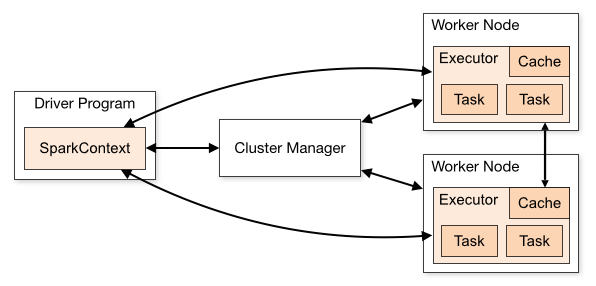
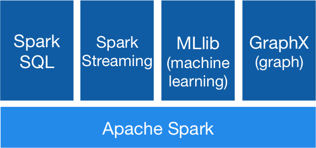
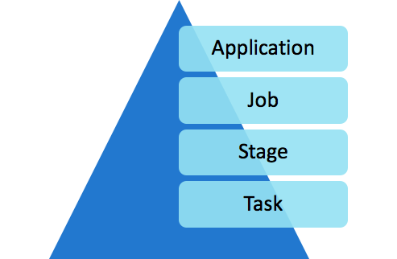

# Start Your Journey with Apache Spark — Part 1
This document covers Understanding Apache Spark and RDD (Resilient Distributed Datasets)

# Spark Architecture
Apache Spark works in a master-slave architecture where the master is called **Driver** and slaves are called **Workers**.

The starting point of your Spark application is `sc`, a Spark Context Class instance. It runs inside the driver.



Let’s try to understand the architecture of Apache Spark :



- **Apache Spark**: Sometimes also called Spark Core. The Spark Core implementation is a RDD (Resilient Distributed Dataset) which is a collection of distributed data across different nodes of the cluster that are processed in parallel.
- **Spark SQL**: The implementation here is DataFrame, which is a relational representation of the data. It provides functions with SQL like capabilities. Also, we can write SQL like queries for our data analysis.
- **Spark Streaming**: The implementation provided by this library is D-stream, also called Discretized Stream. This library provides capabilities to process/transform data in near real-time.
MLlib: This is a Machine Learning library with commonly used algorithms including collaborative filtering, classification, clustering, and regression.
- **GraphX**: This library helps us to process Graphs, solving various problems (like Page Rank, Connected Components, etc) using Graph Theory.


## RDD Creation
Let’s dig a little deeper into Apache Spark (Spark Core), starting with RDD.

Let’s create a RDD

- Create a RDD based on Python collection.
    ```python
    keywords = [‘Books’, ‘DVD’, ‘CD’, ‘PenDrive’]
    key_rdd = sc.parallelize(keywords)
    ```
    In the above code `keywords` is a python collection (List) and we are creating a RDD from a Python collection using the `parallelize` method of the Spark Context Class.

- Create a RDD from a file
    ```python
    file_rdd = sc.textFile(“Path_to_File”)
    ```

## RDD Operations
There are two types of operations performed on a RDD :
- **Transformations**: These operations work in a lazy fashion. When you apply a transformation on a RDD it will not be evaluated immediately but will only be stored in a DAG (Directed Acyclic Graph) and will be evaluated at some later point of time after an action is executed. Some common transformations are `map`, `filter`, `flatMap`, `groupByKey`, `reduceByKey`, etc.
- **Actions**: These operations will be executed immediately. Some common actions are `first`, `last`, `count`, `collect`, etc.

> Note: RDDs are immutable in nature, you cannot change RDDs. However, you can transform one RDD to another using various Transformations.


# Anatomy of Spark Job


- **Application**: When we submit the Spark code to a cluster it creates a Spark Application.
- **Job**: The Job is the top-level execution for any Spark application. A Job corresponds to an Action in a Spark application.
- **Stage**: Jobs will be divided into stages. The *Transformations* work in a lazy fashion and will not be executed until an *Action* is called. Actions might include one or many Transformations and the Transformations define the breakdown of jobs into stages, which corresponds to a shuffle dependency.
- **Task**: Stages will be further divided into various tasks. The task is the most granular unit in Spark applications. Each task represents a local computation on a particular node in the Spark Cluster.

Now we have a understanding of Spark, Spark Architecture, RDDs and the anatomy of a Spark Application. 


# Resilient Distributed Datasets
Let’s get our hands dirty with some hands-on exercises.

You can execute your Spark code by using a shell (Spark-shell or pyspark), Jupyter Notebooks, Zeppelin Notebooks, Spark-submit, etc.

## RDD Implementation
Let’s create a RDD and understand some basic transformations.

- Create a RDD from a collection.
    ```python
    num = [1,2,3,4,5]
    num_rdd = sc.parallelize(num)
    ```
    Here `num_rdd` is an RDD based on Python collection(list).

## Transformations
As we know, **Transformations** are lazy in nature and they will not be executed until an **Action** is executed on top of them. Let’s try to understand various available Transformations.

- `map`: This will map your input to some output based on the function specified in the `map` function.
    We already have `num_rdd` created. Let’s try to double each number in RDD.
    ```python
    double_rdd = num_rdd.map(lambda x : x * 2)
    ```
    > Note: The expression specified inside the `map` function is another function without any name which is called a `lambda` function or anonymous function.

- `filter`: To filter the data based on a certain condition. Let’s try to find the even numbers from `num_rdd`.
    ```python
    even_rdd = num_rdd.filter(lambda x : x % 2 == 0)
    ```

- `flatMap`: This function is very similar to map, but can return multiple elements for each input in the given RDD.
    ```python
    flat_rdd = num_rdd.flatMap(lambda x : range(1,x))
    ```
    This will return the range object for each element in the input RDD (`num_rdd`).

- `distinct`: This will return distinct elements from an RDD.
    ```python
    rdd1 = sc.parallelize([10, 11, 10, 11, 12, 11])
    dist_rdd = rdd1.distinct()
    ```

The above Transformations are single-valued, where each element within a RDD contains a single scalar value. Let’s discuss some key-value pair RDDs, where each element of the RDD will be a (key, value) pair.

- `reduceByKey`: This function reduces the key values pairs based on the keys and a given function inside the `reduceByKey`. Here’s an example.
    ```python
    pairs = [ (“a”, 5), (“b”, 7), (“c”, 2), (“a”, 3), (“b”, 1), (“c”, 4)]
    pair_rdd = sc.parallelize(pairs)
    # pair_rdd is now key-value pair RDD.

    output = pair_rdd.reduceByKey(lambda x, y : x + y)
    ```
    
    the output RDD will contain the pairs :
    ```python
    [ (“a”, 8), (“b”, 8), (“c”, 6) ]
    ```

    Let’s try to understand the contents of the output RDD here. We can think of the reduceByKey function in 2 steps.

    1. It will collect all the values for a given key. So the intermediate output will be as follows :
    ```python
    (“a”, <5,3>)
    (“b”, <7, 1>)
    (“c”, <2, 4>)
    ```
    
    2. Now we have all the values corresponding to a particular key. Then the `values` collection will be reduced or aggregated based on the function mentioned inside the `reduceByKey`. In our case it is the sum function, so we are getting the sum of all the values for a given key. Hence the output is :
    ```python
    [ (“a”, 8), (“b”, 8), (“c”, 6) ]
    ```

- `groupByKey`: This function is another *ByKey* function which can operate on a (key, value) pair RDD but this will only group the values based on the keys. In other words, this will only perform the first step of reduceByKey.
    ```python
    grp_out = pair_rdd.groupByKey()
    ```

- `sortByKey`: This function will perform the sorting on a (key, value) pair RDD based on the keys. By default, sorting will be done in ascending order.
    ```python
    pairs = [ (“a”, 5), (“d”, 7), (“c”, 2), (“b”, 3)]
    raw_rdd = sc.parallelize(pairs)
    sortkey_rdd = raw_rdd.sortByKey()
    ```

    This will sort the pairs based on keys. So the output will be
    ```python
    [ (“a”, 5), (“b”, 3), (“c”, 2), (“d”, 7)]
    ```

    > Note: for sorting in descending order pass “ascending=False”.

- `sortBy`: sortBy is a more generalized function for sorting.
    ```python
    pairs = [ (“a”, 5, 10), (“d”, 7, 12), (“c”, 2, 11), (“b”, 3, 9)]
    raw_rdd = sc.parallelize(pairs)
    ```

    Now we have got a RDD of tuples where each tuple has 3 elements in it. Let’s try to do the sorting based on the 3rd element of the tuple.
    ```python
    sort_out = raw_rdd.sortBy(lambda x : x[2])
    ```

    > Note: for sorting in descending order pass “ascending=False”.

There are various other Transformations which you can find on Spark documentation.

## Actions:
Actions are operations on RDDs which execute immediately. While Transformations return another RDD, Actions return language native data structures.
    ```python
    ```


- `count`: This will count the number of elements in the given RDD.
    ```python
    num = sc.parallelize([1,2,3,4,2])
    num.count() # output : 5
    ```

- `first`: This will return the first element from given RDD.
    ```python
    num.first() # output : 1
    ```

- `collect`: This will return all the elements for the given RDD.
    ```python
    num.collect() # output : [1,2,3,4,2]
    ```

> Note: We should not use the collect operation while working with large datasets.
> Because it will return all the data which is distributed across the different workers of your cluster to a driver.
> All the data will travel across the network from worker to driver and also the driver would need to hold all the data.
> This will hamper the performance of your application.

- `take`: This will return the number of elements specified.
    ```python
    num.take(3) # output : [1, 2, 3]
    ```

There are various other actions which you can find on Spark documentation.

