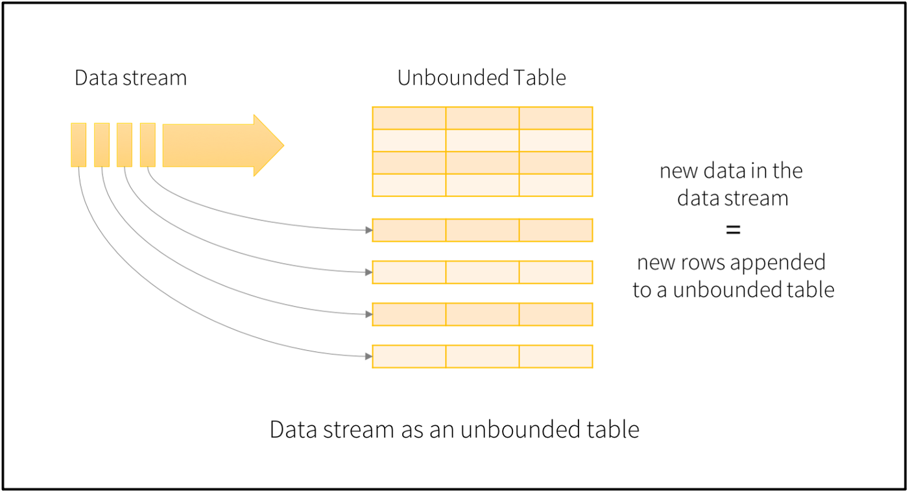

# Spark Streaming
Code base uses Scala.
All files are at: https://github.com/NeerajBhadani/spark-streaming/tree/master/src/main/scala


# Overview
Working with streaming data is a little different from working with batch data. With streaming data, we will never have complete data for analysis, as data is continuously coming in. Apache Spark provides a streaming API to analyze streaming data in pretty much the same way we work with batch data. Apache Spark Structured Streaming is built on top of the Spark-SQL API to leverage its optimization. Spark Streaming is a processing engine to process data in real-time from sources and output data to external storage systems.

Spark Streaming has 3 major components: input sources, streaming engine, and sink. Input sources generate data like Kafka, Flume, HDFS/S3, etc. Spark Streaming engine processes incoming data from various input sources. Sinks store processed data from Spark Streaming engine like HDFS, relational databases, or NoSQL datastores.

Let’s conceptualise Spark Streaming data as an unbounded table where new data will always be appended at the end of the table.



Spark will process data in micro-batches which can be defined by triggers. For example, let's say we define a trigger as `1 second`, this means Spark will create micro-batches every second and process them accordingly. We will discuss triggers in a separate blog.

# Output modes
After processing the streaming data, Spark needs to store it somewhere on persistent storage. Spark uses various output modes to store the streaming data.
- **Append Mode**: In this mode, Spark will output only newly processed rows since the last trigger.
- **Update Mode**: In this mode, Spark will output only updated rows since the last trigger. If we are not using aggregation on streaming data (meaning previous records can’t be updated) then it will behave similarly to append mode.
- **Complete Mode**: In this mode, Spark will output all the rows it has processed so far.

# Our first streaming example using rate source
Now let’s get our hands dirty with our first Spark Streaming example using `rate` source and `console` sink. Rate source will auto-generate data which we will then print onto a console.

# Import libraries
Let’s first import the required libraries:
```
import org.apache.spark.sql.{SparkSession}
import org.apache.spark.sql.functions._
```

# Create Spark session
Now let’s create the `sparkSession` and set the logging level to `Error` to avoid the `Warning` and `INFO` logs.
```
// Create Spark Session
val spark = SparkSession
  .builder()
  .master("local")
  .appName("Rate Source")
  .getOrCreate()

// Set Spark logging level to ERROR to avoid various other logs on console.
spark.sparkContext.setLogLevel("ERROR")
```

# Create streaming DataFrame
Let’s create our first Spark Streaming DataFrame using `rate` source. Here we have specified the format as `rate` and specified `rowsPerSecond = 1` to generate `1` row for each micro-batch and load the data into `initDF` streaming DataFrame. Also, we check if the `initDF` is a streaming DataFrame or not.
```
val initDF = (spark
  .readStream
  .format("rate")
  .option("rowsPerSecond", 1)
  .load()
  )

println("Streaming DataFrame : " + initDF.isStreaming)
```

Output should read as follows:
```
Streaming DataFrame : true
```

# Basic transformation
Perform a basic transformation on `initDF` to generate another column `result` by just adding `1` to column `value`:
```
val resultDF = initDF
    .withColumn("result", col("value") + lit(1))
```

We created a derived column `result` from an existing column `value` in a very similar way to creating one in a batch DataFrame. You can find various operations on batch DataFrame.

# Output to console
Let’s try to print the contents of a streaming DataFrame to console. Here, we use `append` output mode to output only newly generated data and format as `console` to print the result on the console.
```
resultDF
  .writeStream
  .outputMode("append")
  .option("truncate", false)
  .format("console")
  .start()
  .awaitTermination()
```

This output should resemble the following:
```sh
-------------------------------------------
Batch: 1
-------------------------------------------
+-----------------------+-----+------+
|timestamp              |value|result|
+-----------------------+-----+------+
|2020-12-28 11:40:37.867|0    |1     |
+-----------------------+-----+------+-------------------------------------------
Batch: 2
-------------------------------------------
+-----------------------+-----+------+
|timestamp              |value|result|
+-----------------------+-----+------+
|2020-12-28 11:40:38.867|1    |2     |
+-----------------------+-----+------+
```

Here we printed the result of 2 micro-batches which contain columns `timestamp`, `value` and the generated `result` column. We have only one record per second (check timestamps above) as specified in `initDF` and value was generated automatically. Also, in each batch we only get newly generated data since we have used the append output mode.

We have successfully written our first spark streaming application!
