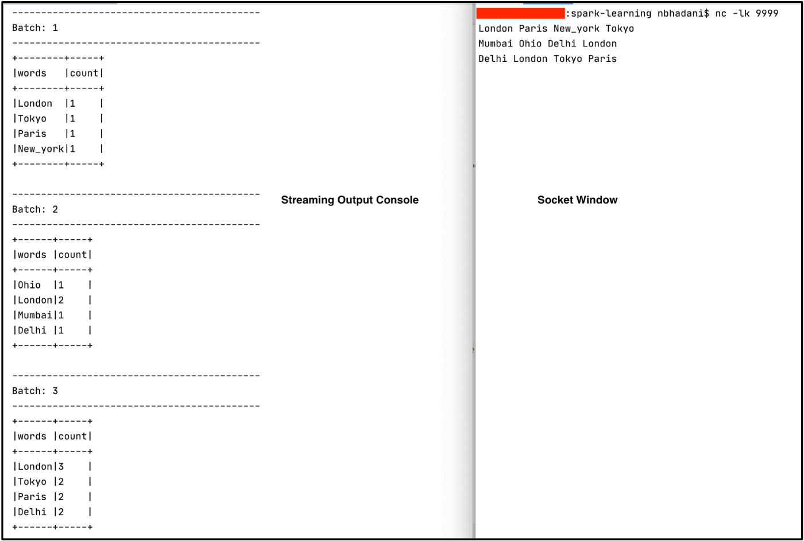
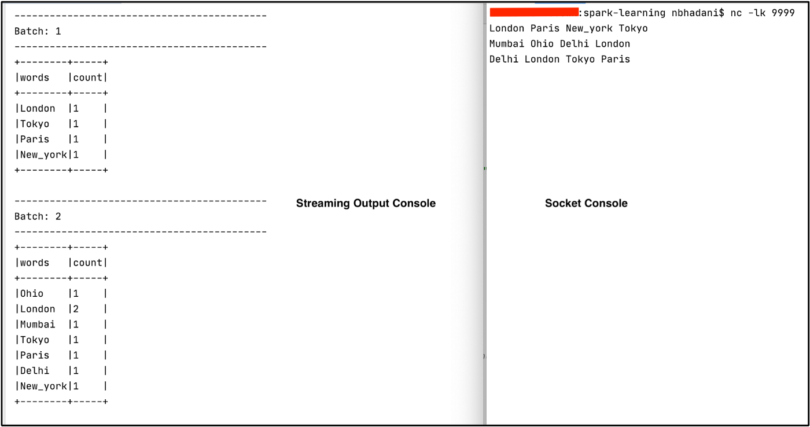

In this blog, we discuss further input sources in detail using examples.

# Input Sources
Spark Streaming ingests data from different types of input sources for processing in real-time:
- **Rate (for Testing)**: It will automatically generate data including 2 columns timestamp and value . This is generally used for testing purposes. We demonstrated this in part 1 of this series.
- **Socket (for Testing)**: This data source will listen to the specified socket and ingest any data into Spark Streaming. It is also used only for testing purposes.
- **File**: This will listen to a particular directory as streaming data. It supports file formats like CSV, JSON, ORC, and Parquet.
- **Kafka**: This will read data from Apache Kafka® and is compatible with Kafka broker versions 0.10.0 or higher

It’s time to get our hands dirty. Let's ingest data from each of the input sources.

# Input Sources — Socket
## Setup
Import libraries and create Spark Session
```
// Import Libraries
import org.apache.spark.sql.SparkSession
import org.apache.spark.sql.functions._

// Create Spark Session
val spark = SparkSession
  .builder()
  .master("local")
  .appName("Socket Source")
  .getOrCreate()

// Set Spark logging level to ERROR.
spark.sparkContext.setLogLevel("ERROR")
```

## Create Streaming DataFrame
Create Streaming DataFrame using `socket` source. Also, check if DataFrame `isStreaming`.
```
// Define host and port number to Listen.
val host = "127.0.0.1"
val port = "9999"

// Create Streaming DataFrame by reading data from socket.
val initDF = (spark
  .readStream
  .format("socket")
  .option("host", host)
  .option("port", port)
  .load())

// Check if DataFrame is streaming or Not.
println("Streaming DataFrame : " + initDF.isStreaming)
```

We use the socket format to read data from a socket (`127.0.0.1:9999`). You can use any arbitrary permitted port to listen.

Output:
```
Streaming DataFrame : true
```


## Transformation: Word Count
Here we count words from a stream of data coming from this socket. Also, we check the schema of our streaming DataFrame.
```
// Perform word count on streaming DataFrame
val wordCount = (initDF
  .select(explode(split(col("value"), " ")).alias("words"))
  .groupBy("words")
  .count()
  )

// Print Schema of DataFrame
println("Schema of DataFame wordCount.")
println(wordCount.printSchema())
```

Output:
```
Schema of DataFame wordCount.
root
 |-- words: string (nullable = true)
 |-- count: long (nullable = false)
```


## Output to Console
Print the contents of streaming DataFrame `wordCount` on console.
```
wordCount
  .writeStream
  .outputMode("update") // Try "update" and "complete" mode.
  .option("truncate", false)
  .format("console")
  .start()
  .awaitTermination()
```

Open the port `9999` on `localhost`(`127.0.0.1`) and send some data to count. We use the netcat utility to open the port. Open a terminal and run the command below.
```
nc -lk 9999
```

Start the streaming application and send data to the port.

> Note: Make sure you have the socket open before you start the streaming application.



On the right window we send data to our socket and on the left our Spark Streaming application prints to the console. We get a word count on the output console of the data sent to the socket. Since we are running our Spark Stream application in `update` output mode, we see that only records that are updated in a particular batch are output to the console. From the first line, `London Paris New_york Tokyo`, we have the output in `Batch:1`. From the second line, `Mumbai Ohio Delhi London`, we have the output in `Batch:2` (Note that we sent the second line only once the first line was fully processed). Since `Mumbai Ohio Delhi` are new records and our streaming application has seen `London` for a second time, we have got the count as `2` for `London` and `1` for rest of the words in second line `Mumbai Ohio Delhi`. Also, the words from the first line which don’t appear in second line are not printed on output of `Batch:2`. Again this is because we are working in `update` output mode which only prints updated records.

Try out `complete` output mode as well and see how it works.

Note: kill the process running on port `9999` to start again for `complete` mode. Or use a different port.

```
// Find the process id using below command on terminal.
ps | grep 9999// kill process using below command.
kill -9 <p_id>
```

Again, open the port using the `nc` command and start the streaming application in `complete` mode.



On the right window, we send data to our socket and the left our Spark Streaming application prints. `Batch:1` and `Batch:2` represent the output for line-1 and line-2 respectively. In `complete` mode, for `Batch:2` we get all the records our streaming application has seen so far. For e.g. Tokyo is only present in line-1 but not in line-2. However, we get `Tokyo` in `Batch:2` as well because `complete` mode writes all the records it has processed so far.

> Note: Output for line-3 is trimmed out of the screenshot.

Code: https://github.com/NeerajBhadani/spark-streaming/blob/master/src/main/scala/streamSocketSource.scala


# Input Sources — File
With file input source, our application will wait for available data in the specified directory. We will use some of the stock data available here. For example, `Apple` stock data present in this file: `AAPL_2006–01–01_to_2018–01–01.csv`. We will take the data for a few years like 2015, 2016, and 2017 and manually save it to a different file like `AAPL_2015.csv`, `AAPL_2016.csv` and `AAPL_2017.csv` respectively. Similarly, we will create the sample data for Google, Amazon, and Microsoft as well. We will keep all the CSV files locally under data/stocks folder. Also, create another folder data/stream which we will use to simulate the streaming data.

## Setup
```
// Import Libraries
import org.apache.spark.sql.SparkSession
import org.apache.spark.sql.functions._
import org.apache.spark.sql.Column
import org.apache.spark.sql.types._

// Create Spark Session
val spark = SparkSession
  .builder()
  .master("local")
  .appName("File Source")
  .getOrCreate()

// Set Spark logging level to ERROR.
spark.sparkContext.setLogLevel("ERROR")
```

## Schema
Our data contains the fields `Date,Open,High,Low,Close,Adj Close,Volume` and we will extract `Name` from the filename using a custom function.

Here we define the schema and write a custom function to extract the stock ticker symbol:
```
// Define Schema
val schema = StructType(List(
  StructField("Date", StringType, true),
  StructField("Open", DoubleType, true),
  StructField("High", DoubleType, true),
  StructField("Low", DoubleType, true),
  StructField("Close", DoubleType, true),
  StructField("Adjusted Close", DoubleType, true),
  StructField("Volume", DoubleType, true)
))

// Extract the Name of the stock from the file name.
def getFileName : Column = {
  val file_name = reverse(split(input_file_name(), "/")).getItem(0)
  split(file_name, "_").getItem(0)
}
```

## Create Streaming DataFrame
```
// Create Streaming DataFrame by reading data from File Source.
val initDF = (spark
  .readStream
  .format("csv")
  .option("maxFilesPerTrigger", 2) // This will read maximum of 2 files per mini batch. However, it can read less than 2 files.
  .option("header", true)
  .option("path", "data/stream")
  .schema(schema)
  .load()
  .withColumn("Name", getFileName)
  )
```

We create a streaming DataFrame to read csv data from a specified directory `data/stream` and apply the above schema. We also specify the param `maxFilesPerTrigger = 2` , which means our application will process a maximum of 2 CSV files in each batch. At the end, we create another column called `Name` using the function `getFileName`. That column contains stock ticker symbols like GOOGL, AMZN, AAPL etc.


## Transformation
Perform basic aggregation on our streaming DataFrame.
```
val stockDf = initDF
         .groupBy(col("Name"), year(col("Date")).as("Year"))
         .agg(max("High").as("Max"))
```

We group the data based on stock Name, Year and find the maximum value of the HIGH column.

We can also perform the above transformation using a SQL query. In this code sample, we register the streaming DataFrame as a temporary view and execute a SQL query on it.
```
// Register DataFrame as view. 
initDF.createOrReplaceTempView("stockView")

// Run SQL Query
val query = """select year(Date) as Year, Name, max(High) as Max from stockView group by Name, Year"""
val stockDf = spark.sql(query)
```


## Output to Console
Print the contents of streaming DatFrame to console using `update` mode.
```
stockDf
  .writeStream
  .outputMode("update") // Try "update" and "complete" mode.
  .option("truncate", false)
  .option("numRows", 3)
  .format("console")
  .start()
  .awaitTermination()
```

Let’s start our streaming application now, it waits for data in the data/stream folder. Copy files in the sequence below from `data/stocks` to `data/stream` to simulate streaming.
- MSFT_2017.csv
- GOOGL_2017.csv
- MSFT_2016.csv
- AMZN_2017.csv

First we moved the file MSFT_2017.csv and got a max `HIGH` stock value in `Batch: 0` for Microsoft 2017. Second, we moved GOOGL_2017.csv and got the output for Google 2017 in `Batch: 1`. Third, we moved MSFT_2016 and saw the output for Microsoft 2016 in `Batch:2`. Since we used `update` mode, only updated records are output to console. Feel free to try out complete mode at your end. Please find below the output of complete mode as well.

Github: https://github.com/NeerajBhadani/spark-streaming/blob/master/src/main/scala/streamFileSource.scala


# Input Sources — Kafka
We will read data from Kafka and display it on the console. In order to read data from Kafka, first we need to set up Kafka and publish messages to a Kafka topic which we will then read into Spark Streaming.

## Kafka Setup
You can follow below steps to setup Kafka.
- Install Kafka: We can refer to this article to install Kafka: https://docs.confluent.io/platform/current/platform-quickstart.html#quick-start-for-cp
- Start Confluent Service
```
confluent local services start
```
- Create a Kafka Topic
```
kafka-topics --create \
--zookeeper localhost:2181 \
    --replication-factor 1 \
    --partitions 1 \
    --topic test
```
- List Kafka Topic
```
List Kafka Topic
```
- Publish data to a Kafka topic, so that we can read it back into Spark Streaming
```
kafka-console-producer --broker-list localhost:9092 --topic test
```
- Consume data from Kafka topic to verify the published data.
```
kafka-console-consumer --bootstrap-server localhost:9092 --topic test
```

## Spark Streaming Setup
Import required libraries and create a Spark session.
```
// Import Libraries
import org.apache.spark.sql.SparkSession

// Create Spark Session
val spark = SparkSession
  .builder()
  .master("local")
  .appName("Kafka Source")
  .getOrCreate()

// Set Spark logging level to ERROR.
spark.sparkContext.setLogLevel("ERROR")
```

## Create Streaming DataFrame
Read data from Kafka into Spark Streaming.
```
val initDf = spark
  .readStream
  .format("kafka")
  .option("kafka.bootstrap.servers", "localhost:9092")
  .option("subscribe", "test")
  .load()
  .select(col("value").cast("string"))
```

We use the kafka format to read data from Kafka. We specify the details of our locally installed Kafka bootstrap server and subscribe to Kafka topic test created above. At last, we select only data ingested into Kafka topic which is present in the value column.

## Transformation
Perform simple word count similar to socket source example.
```
val wordCount = initDF
  .select(explode(split(col("value"), " ")).alias("words"))
  .groupBy("words")
  .count()
```

## Output to Console
Print the contents of streaming DataFrame to console.
```
wordCount
  .writeStream
  .outputMode("update")
  .format("console")
  .start()
  .awaitTermination()
```

Output looks very similar to our `socket` source example but this time our streaming application reads data from Kafka.


