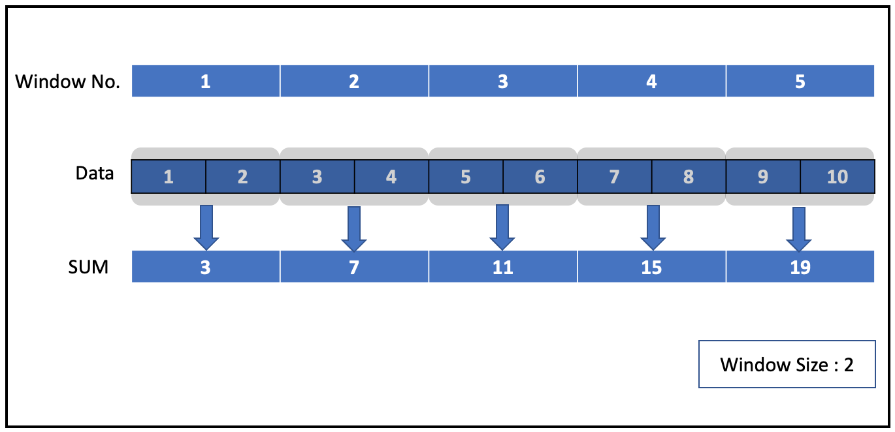
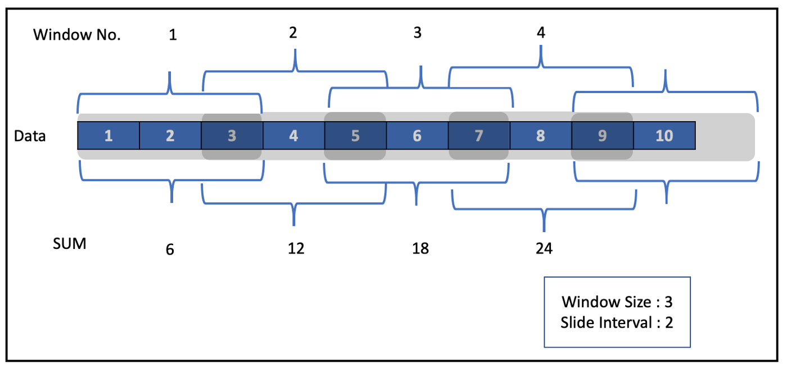

In this post, we discuss operations that we can perform in Spark Streaming like filter, join, UDF, and window.

# Setup
Let’s start by creating a streaming DataFrame named `initDF` from a file source by reading two files in each micro-batch to perform some of the above-mentioned operations. We use `console` output throughout this blog which we discussed in detail in our previous blogs.
```
// Import Libraries
import org.apache.spark.sql.SparkSession
import org.apache.spark.sql.functions._
import org.apache.spark.sql.Column
import org.apache.spark.sql.types._

// Create Spark Session
val spark = SparkSession
  .builder()
  .master("local")
  .appName("File Source")
  .getOrCreate()

// Set Spark logging level to ERROR.
spark.sparkContext.setLogLevel("ERROR")

val schema = StructType(List(
  StructField("Date", StringType, true),
  StructField("Open", DoubleType, true),
  StructField("High", DoubleType, true),
  StructField("Low", DoubleType, true),
  StructField("Close", DoubleType, true),
  StructField("Adjusted Close", DoubleType, true),
  StructField("Volume", DoubleType, true)
))

// Extract the Name of the stock from the file name.
def getFileName : Column = {
  val file_name = reverse(split(input_file_name(), "/")).getItem(0)
  split(file_name, "_").getItem(0)
}

// Create Streaming DataFrame by reading data from socket.
val initDF = (spark
  .readStream
  .option("maxFilesPerTrigger", 2)
  .option("header", true)
  .schema(schema)
  .csv("data/stream")
  .withColumn("Name", getFileName)
  )
```


# Filter
Now let’s perform simple `select` and `filter` operations. We filter records if the stock closed with some gain on a particular day.
```
// Perform select and Filter operation.
val resultDF = initDF.select("Name", "Date", "Open", "Close")
                    .filter(col("Close") - col("Open") > 0)
```

Let’s check the contents of the above DataFrame.
```
-------------------------------------------
Batch: 0
-------------------------------------------
+-----+----------+----------+----------+
| Name|      Date|      Open|     Close|
+-----+----------+----------+----------+
|GOOGL|2017-01-03|800.619995| 808.01001|
|GOOGL|2017-01-05|     807.5| 813.02002|
|GOOGL|2017-01-06| 814.98999|825.210022|
+-----+----------+----------+----------+
only showing top 3 rows
```

We get records with selected columns and where Close is greater than Open. 

Github: https://github.com/NeerajBhadani/spark-streaming/blob/master/src/main/scala/streamFilterOperation.scala


# GroupBy
Now let’s perform a simple aggregation operation using groupBy to find the year-wise maximum `HIGH` price for each stock. Copy file `MSFT_2017.csv` to `data/stream` a folder to simulate streaming data.
```
val resultDF = initDF.groupBy($"Name", year($"Date").as("Year"))
          .agg(max("High").as("Max"))
```

Let’s check the content of resultDF DataFrame as follow.
```
+----+----+----+
|Name|Year|Max |
+----+----+----+
|MSFT|2017|87.5|
+----+----+----+
```

Here we get the maximum stock price for Microsoft in 2017.


# Joins
Here we discuss join operations with Streaming DataFrames. We can join a Streaming DataFrame with another Streaming DataFrame and call it a stream-stream join. Also, we can join a Streaming DataFrame with a Batch DataFrame and call it a stream-batch join.

Let’s start with stream-batch join.

## Stream-Batch Join
With stream-batch joins, we can join a batch DataFrame with a streaming DataFrame. Let’s discuss with an example.

Our streaming DataFrame is the initDF defined in the Setup section above. We create a batch DataFrame from the COMPANY.CSV file which contains two columnsName and FullCompanyName. Here is the sample data for COMPANY.CSV file.
```
Name,FullCompanyName
AAPL,Apple
AMZN,Amazon
GOOGL,Google
```

Code:
```
// Create Batch DataFrame
val companyDF = spark.read.option("header", true)
                  .csv("data/stocks/COMPANY.csv")
companyDF.show(3)
```

Output:
```
+-----+---------------+
| Name|FullCompanyName|
+-----+---------------+
| AAPL|          Apple|
| AMZN|         Amazon|
|GOOGL|         Google|
+-----+---------------+
```

Let’s perform an inner join on streaming DataFrame (`resultDF`) and batch DataFrame (`companyDF`).
```
val joinDf = resultDF.join(companyDF, Seq("Name"), "inner")
```

Here is the output of the first micro-batch:
```
+-----+---------------+----+-------+
|Name |FullCompanyName|Year|Max    |
+-----+---------------+----+-------+
|AMZN |Amazon         |2017|1213.41|
|GOOGL|Google         |2017|1086.49|
+-----+---------------+----+-------+
```

Let’s perform `left_outer` join with streaming DataFrame on left and batch DataFrame on right.
```
val joinDf = resultDF.join(companyDF, Seq("Name"), "left_outer")
```

Output for one of the micro-batches:
```
+-----+----+-------+---------------+
|Name |Year|Max    |FullCompanyName|
+-----+----+-------+---------------+
|MSFT |2017|87.5   |null           |
|AMZN |2017|1213.41|Amazon         |
|GOOGL|2017|1086.49|Google         |
+-----+----+-------+---------------+
```

`FullCompanyName` is `null` for `Name = MSFT` because we don’t have any such record in `companyDF` .

> Note: `right_outer` join would work similarly if we switch the order of DataFrames.

Let’s perform `left_outer` join with batch DataFrame on left and streaming DataFrame on right.
```
val joinDf = companyDF.join(resultDF, Seq("Name"), "left_outer")
```

We will get the error below.
```
Exception in thread "main" org.apache.spark.sql.AnalysisException: Left outer join with a streaming DataFrame/Dataset on the right and a static DataFrame/Dataset on the left is not supported;;
```

Here we are matching all the records from a static DataFrame on the left with a stream DataFrame on right. If records do not match from the static DF (Left) to stream DF (Right) then the system cannot return `null`, since the data changes on stream DF (Right) and we cannot guarantee if we will get matching records. That is why `full_outer` join is not supported. You can find the supported join details here (http://spark.apache.org/docs/latest/structured-streaming-programming-guide.html#support-matrix-for-joins-in-streaming-queries) as well. You can find the complete code on GitHub (https://github.com/NeerajBhadani/spark-streaming/blob/master/src/main/scala/streamStaticJoins.scala).

Note: We will get the same error with right_outer join with streaming DataFrame on left and batch DataFrame on right side of the join.

## Stream-stream join
Let’s create 2 streaming DataFrames from `initDF` defined above and check if they are streaming DataFrames.
```
val streamDf1 = initDF.select("Name", "Date", "High", "Low")
val streamDf2 = initDF.select("Name", "Date", "Open", "Close")

// Check if DataFrame is streaming or Not.
println("streamDf1 Streaming DataFrame : " + streamDf1.isStreaming)
println("streamDf2 Streaming DataFrame : " + streamDf2.isStreaming)
```

Output:
```
streamDf1 Streaming DataFrame : true
streamDf2 Streaming DataFrame : true
```

Now we perform an inner join operation on the above DataFrames based on `Name` and `Date` column.
Output for one of the sample micro-batch.
```
+----+----------+-----------+-----------+-----------+-----------+
|Name|Date      |High       |Low        |Open       |Close      |
+----+----------+-----------+-----------+-----------+-----------+
|AMZN|2017-04-11|911.23999  |897.5      |907.039978 |902.359985 |
|AMZN|2017-07-20|1034.969971|1022.52002 |1031.589966|1028.699951|
|AMZN|2017-08-02|1003.210022|981.72998  |1001.77002 |995.890015 |
+----+----------+-----------+-----------+-----------+-----------+
```

In `joinDF` streaming DataFrame, we have `High` and `Low` columns from `streamDf1` and `Open` and `Close` from `streamDf2` streaming DataFrame.

Github: https://github.com/NeerajBhadani/spark-streaming/blob/master/src/main/scala/streamStreamJoin.scala

`left_outer` and `right_outer` joins are conditionally supported with watermark but `full_outer` join is not supported. You can find more details here.


# UDF — User Defined Function
Similar to batch DataFrame we can also perform user-defined functions (UDF) on streaming DataFrames as well. Let’s create a UDF to see if the stock is Up or Down on a given day.
```
// Define function
def up = (close:Double, open:Double) => {
  if ((close - open) > 0)
    "UP"
  else
    "Down"
}

// Register up function as UDF.
val upUdf = udf(up)
```

Now let’s apply the above-defined UDF on initDF streaming DataFrame.
```
val resultDF = initDF
  .withColumn("up_down_udf", upUdf(col("Close"), col("Open")))
```

Output for one of the micro-batch
```
+----+----------+----------+----------+-----------+
|Name|Date      |Open      |Close     |up_down_udf|
+----+----------+----------+----------+-----------+
|AMZN|2017-01-03|757.919983|753.669983|Down       |
|AMZN|2017-01-04|758.390015|757.179993|Down       |
|AMZN|2017-01-05|761.549988|780.450012|UP         |
|AMZN|2017-01-06|782.359985|795.98999 |UP         |
|AMZN|2017-01-09|798.0     |796.919983|Down       |
+----+----------+----------+----------+-----------+
```

You can verify the values in `up_down_udf` column based on `upUDF`.

We can also use UDFs in SQL queries as well
```
// Register UDF
spark.udf.register("up_down", up)

// Create Temp View
initDF.createOrReplaceTempView("initDF")

// Apply UDF in SQL query.
val resultDF = spark.sql("select *, up_down(Close, Open) as up_down_udf from initDF")
```

Github: https://github.com/NeerajBhadani/spark-streaming/blob/master/src/main/scala/streamUdf.scala


# Window
Window operations are very similar to `groupBy` operations. In `groupBy`, aggregation is based on the specified group or key while in window operations aggregation is based on event windows. Spark supports 2 types of windows Tumbling window and Sliding window.

Let’s discuss each one of them in detail. Take an example of numbers from 1–10 and we will calculate SUM using different window operations.

## Tumbling window
Tumbling windows are non-overlapping which means each data point will be part of only one window.



Here the size of the window is 2 and we have 5 non-overlapping windows along with the sum of the elements in each window. Also, we can verify that none of the elements are overlapping between windows.

Now let us define one in our streaming application. We can use a window function and specify the `DateTime` column and `window` duration say 2 minutes or 30 seconds or 1 hour or 5 days etc.

Let’s consider the initDF defined above in the Setup section and try to apply a window function.
```
val resultDF = initDF.select("Name", "Date", "Open", "High", "Low")
  .groupBy(window($"Date", "10 days"), $"Name")
  .agg(max("High").as("Max"))
  .orderBy($"window.start")
```

Here we used the `Date` column with 10 days as window duration and sorted the result by window start time to check the non-overlapping behavior of tumbling windows.

Now let’s have a look at the first few records from the output of a micro-batch.
```
+------------------------------------------+----+-----+
|window                                    |Name|Max  |
+------------------------------------------+----+-----+
|[2016-12-25 00:00:00, 2017-01-04 00:00:00]|MSFT|62.84|
|[2017-01-04 00:00:00, 2017-01-14 00:00:00]|MSFT|63.4 |
|[2017-01-14 00:00:00, 2017-01-24 00:00:00]|MSFT|63.12|
|[2017-01-24 00:00:00, 2017-02-03 00:00:00]|MSFT|65.91|
+------------------------------------------+----+-----+
```

We can check the size of the window in the `window` column and can see that none of the windows overlap. You can change the duration of the window and check the result yourself as well.

## Sliding window
As its name suggests, this window will slide instead of tumbling on the data. We can specify the level of sliding needed. These are overlapping windows. Let’s first try to understand with a simple example of numbers from 1–10.



Here we have defined the window size as 3 and slide interval as 2. As we can see in the snapshot above, these windows overlap. For example, the number 3 is present in both windows 1 and 2.

To define a sliding window, along with `DateTime` and `Window Size` in the window function, we specify `slide Duration` as the third argument. Let’s try to perform a sliding window operation in our streaming application.
```
val resultDF = initDF.select("Name", "Date", "Open", "High", "Low")
  .groupBy(window($"Date", "10 days", "5 days"), 
          $"Name", year($"Date").as("Year"))
  .agg(max("High").as("Max"))
  .orderBy($"window.start")
```

We used 5 days as our slide duration. Let’s check the output now.
```
+------------------------------------------+----+----+-----+
|window                                    |Name|Year|Max  |
+------------------------------------------+----+----+-----+
|[2016-12-25 00:00:00, 2017-01-04 00:00:00]|MSFT|2017|62.84|
|[2016-12-30 00:00:00, 2017-01-09 00:00:00]|MSFT|2017|63.15|
|[2017-01-04 00:00:00, 2017-01-14 00:00:00]|MSFT|2017|63.4 |
|[2017-01-09 00:00:00, 2017-01-19 00:00:00]|MSFT|2017|63.4 |
+------------------------------------------+----+----+-----+
```

In the output above, the windows overlap. 

Github: https://github.com/NeerajBhadani/spark-streaming/blob/master/src/main/scala/streamWindowOperations.scala
