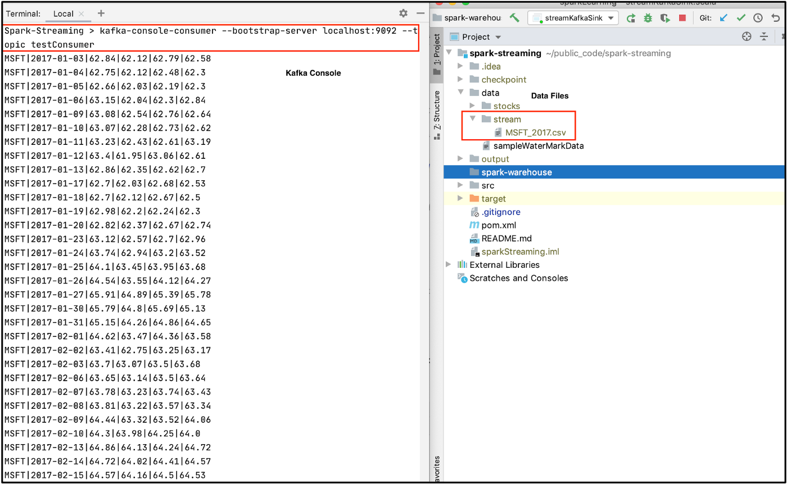

# Spark Streaming Output Sink:
In Spark Streaming, output sinks store results into external storage.
- **Console sink**: Displays the content of the DataFrame to console.
- **File sink**: Stores the contents of a DataFrame in a file within a directory. Supported file formats are csv, json, orc, and parquet.
- **Kafka sink**: Publishes data to a Kafka topic.
- **Foreach sink**: Applies to each row of a DataFrame and can be used when writing custom logic to store data.
- **ForeachBatch sink**: Applies to each micro-batch of a DataFrame and also can be used when writing custom logic to store data.

It’s time to get our hands dirty; let’s discuss each output sink in detail.


# Setup
We use the same `csv` data files as in the input sources post of this series to create a streaming DataFrame from a file source. Please refer to preceding chapter for more details on the code below.
```
// Import libraries
import org.apache.spark.sql.SparkSession
import org.apache.spark.sql.functions._
import org.apache.spark.sql.Column
import org.apache.spark.sql.types._

// Create Spark Session
val spark = SparkSession
  .builder()
  .master("local")
  .appName("File Sink")
  .getOrCreate()

// Set Spark logging level to ERROR.
spark.sparkContext.setLogLevel("ERROR")

// Define Schema
val schema = StructType(List(
  StructField("Date", StringType, true),
  StructField("Open", DoubleType, true),
  StructField("High", DoubleType, true),
  StructField("Low", DoubleType, true),
  StructField("Close", DoubleType, true),
  StructField("Adjusted Close", DoubleType, true),
  StructField("Volume", DoubleType, true)
))

// Extract the Name of the stock from the file name.
def getFileName : Column = {
  val file_name = reverse(split(input_file_name(), "/")).getItem(0)
  split(file_name, "_").getItem(0)
}

// Create Streaming DataFrame by reading data from socket.
val initDF = spark
  .readStream
  .option("maxFilesPerTrigger", 2)
  .option("header", true)
  .schema(schema)
  .csv("data/stream")
  .withColumn("Name", getFileName)
```


# Output sink — Console
Covered in preceding chapter


# Output sink — File
The file sink stores the contents of a streaming DataFrame to a specified directory and format. We use `initDf` (created above) and apply a simple transformation before storing it to the file system.

## Transformation
Perform a very simple transformation by selecting a few columns from initDF
```
val resultDf = initDF.select("Name", "Date", "Open", "Close")
```

## Output to file sink
> Note: File sink only supports append output mode.

Store the content of DataFrame `resultDf` using file sink.
```
resultDf
  .writeStream
  .outputMode("append") // Filesink only support Append mode.
  .format("csv") // supports these formats : csv, json, orc, parquet
  .option("path", "output/filesink_output")
  .option("header", true)
  .option("checkpointLocation", "checkpoint/filesink_checkpoint")
  .start()
  .awaitTermination()
```

We store the results into `csv` files. We also use checkpoint, which we discuss in a separate blog post. Execute the code above and check the output folder `output/filesink_output`.

The output of our `resultDf` DataFrame is stored in directory `output/filesink_output`. Check out the selected columns (`Name`, `Date`, `Open`, `Close`) in the `csv`.

Now change the file format to `json` and review the output. The content of our `resultDf` DataFrame is stored in a `json` file.

You can try `orc` and `parquet` formats as well.


# Output sink — Kafka
With the `kafka` sink, we publish the content of our streaming DataFrame to a Kafka topic using the `initDf` DataFrame defined in the Setup section above. You can refer to this to install Kafka and create a Kafka topic.

## Transformation
Kafka expects data in a column name `value`, so let's concatenate all the column values and store them in one `value` column.
```
val resultDf = initDf.withColumn("value", 
                                 concat_ws("|",$"Name",$"Date",$"High",$"Low",$"Open",$"Close"))
```

Example code: https://github.com/NeerajBhadani/spark-streaming/blob/master/src/main/scala/streamFileSink.scala

## Output to Kafka sink
```
resultDf
  .writeStream
  .format("kafka")
  .option("kafka.bootstrap.servers", "localhost:9092")
  .option("topic", "testConsumer")
  .option("checkpointLocation", "checkpoint/kafka_checkpoint")
  .start()
  .awaitTermination()
```

We pass the value `kafka` to `format()` and specify other necessary Kafka information like `kafka.bootstrap.servers` and the `topic` to which we publish.

## Execute our streaming application
We use the command below to consume the data which our streaming application published to Kafka.
```
kafka-console-consumer --bootstrap-server localhost:9092 --topic testConsumer
```


In the screenshot above, as soon as we drop a file into data/stream (a folder in the right window), we see our transformed output on Kafka’s console on the left window (which is pipe | separated). For easy reference, you can find the complete code on GitHub (https://github.com/NeerajBhadani/spark-streaming/blob/master/src/main/scala/streamKafkaSink.scala).


# Output sink — foreachBatch
So far we discussed sinks where the output system was already defined like `file`, `kafka`, or `console`. What if we would like to store data in any arbitrary storage like a NoSQL DB (for example MongoDB) or a Relational DB (like MySQL). By using `foreach` and `foreachBatch` we can write custom logic to store data. `foreach` performs custom write logic on each row and `foreachBatch` performs custom write logic on each micro-batch.

Using `foreachBatch`, we write each micro-batch to storage defined in our custom logic. In this case, we store the output of our streaming application to MySQL DB.

## Transformation
Select a few columns from `initDF`
```
val resultDf = initDF.select("Name", "Date", "open")
```

## Output to foreachBatch sink
`foreachBatch` takes a function that expects 2 parameters, first: micro-batch as DataFrame or Dataset and second: unique id for each batch. First, create a function with custom write logic to save a micro-batch to MySQL.
```python
def saveToMySql = (df: Dataset[Row], batchId: Long) => {
    val url = """jdbc:mysql://localhost:3306/training"""
      
    df
        .withColumn("batchId", lit(batchId))    # check below
        .write.format("jdbc")
        .option("url", url)
        .option("dbtable", "test")
        .option("user", "root")
        .option("password", <mySQL_PASSWORD>)
        .mode("append")
        .save()
}
#PySpark SQL functions lit() and typedLit() are used to add a new column to DataFrame by assigning a literal or constant value.
# Both these functions return Column type as return type.
```

We specified all the necessary details of MySQL DB like URL, DB name (`training`), Table name (`test`), User name (`root`), and Password.

Use the `savetoMySQL()` function to save our streaming DataFrame to MySQL.
```
resultDf
  .writeStream
  .outputMode("append")
  .foreachBatch(saveToMySql)
  .start()
  .awaitTermination()
```

We use the `foreachBatch` output sink and pass the `saveToMySql()` function to store data in MySQL. Start the application, ingest the data, and check the result on MySQL.

Complete Github: https://github.com/NeerajBhadani/spark-streaming/blob/master/src/main/scala/streamForeachBatchSink.scala


# Output sink — foreach
The `foreach` output sink performs custom write logic to each record in a streaming DataFrame. If `foreachBatch` is not an option, e.g. in continuous processing mode or if a batch data writer does not exist, then we can use the `foreach` sink for custom write logic.

To use `foreach` we need to implement 3 methods (`open`, `process`, and `close`):
- **open**: function to open connection
- **process**: write data to the specified connection
- **close**: function to close connection

## Output to foreach sink
We use `initDF` to read data from a File source. Then we create an instance of the `ForeachWriter` class and implement the `open()`, `process()`, and `close()` methods. We simply print records to console, so we use `println()` statements in the `process()` function.

```
val customWriter = new ForeachWriter[Row] {
  
  override def open(partitionId: Long, version: Long) = true

  override def process(value: Row) = {
    println("Name : "  + value.getAs("Name"))
    println("Open : "  + value.getAs("Open"))
    println("Size : " + value.size)
    println("Values as Seq : " + value.toSeq)
  }
  
  override def close(errorOrNull: Throwable) = {}
}
```

Use the `ForeachWriter` instance defined above to write data using the `foreach` sink.
```
initDF
  .writeStream
  .outputMode("append")
  .foreach(customWriter)
  .start()
  .awaitTermination()
```

We used the `foreach` output sink and provide an instance of `customWriter` defined above. Execute the streaming application and check the result.

As soon as we drop the file `MSFT_2017.csv` into folder `data/stream` on the right-hand window, we see output on the left window defined by process method in the foreach output sink. For easy reference, you can find the complete code on GitHub: https://github.com/NeerajBhadani/spark-streaming/blob/master/src/main/scala/streamForeachSink.scala

