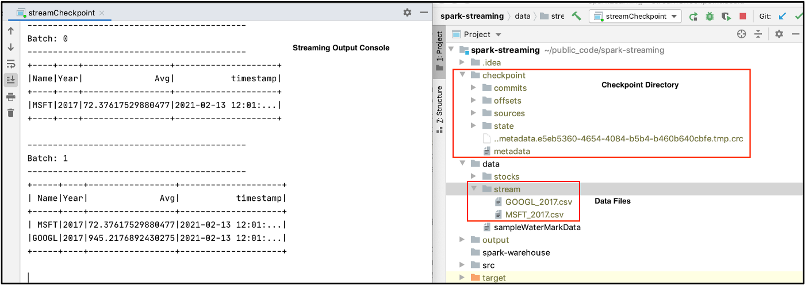
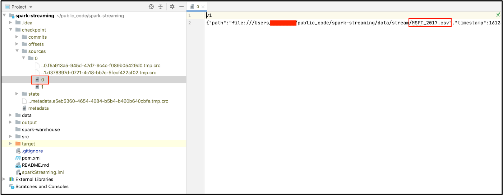
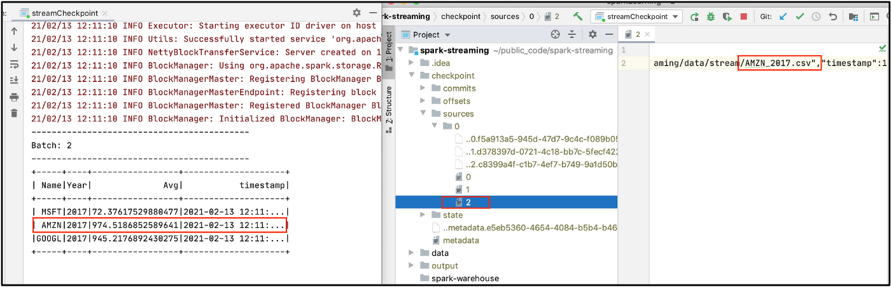
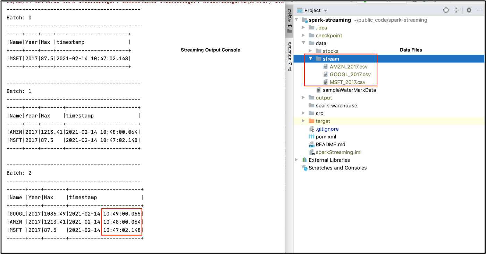
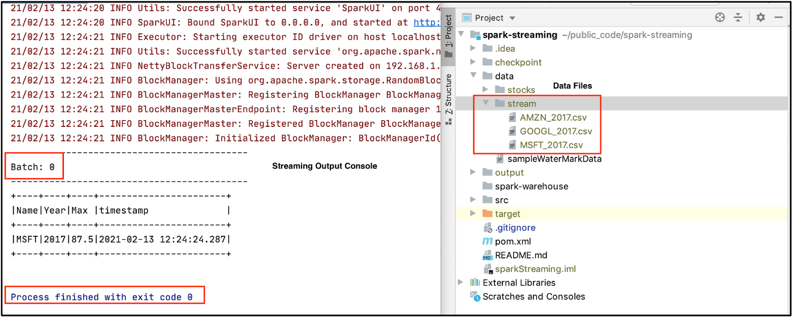

Here we discuss **checkpoints** and **triggers**, important concepts in Spark Streaming.

# Setup
Let’s start creating a streaming DataFrame (`resultDF`) from a file source by reading a file in each micro-batch and performing aggregations. We use this `resultDF` for all examples in this blog post.
```
// Import Libraries
import org.apache.spark.sql.SparkSession
import org.apache.spark.sql.functions._
import org.apache.spark.sql.Column
import org.apache.spark.sql.streaming.Trigger
import org.apache.spark.sql.types._

// Create Spark Session
    val spark = SparkSession
      .builder()
      .master("local")
      .appName("Check Point")
      .getOrCreate()

// Set Spark logging level to ERROR.
    spark.sparkContext.setLogLevel("ERROR")

// Define Schema
    val schema = StructType(List(
      StructField("Date", StringType, true),
      StructField("Open", DoubleType, true),
      StructField("High", DoubleType, true),
      StructField("Low", DoubleType, true),
      StructField("Close", DoubleType, true),
      StructField("Adjusted Close", DoubleType, true),
      StructField("Volume", DoubleType, true)
    ))

    // Extract the Name of the stock from the file name.
    def getFileName : Column = {
      val file_name = reverse(split(input_file_name(), "/")).getItem(0)
      split(file_name, "_").getItem(0)
    }

    // Create Streaming DataFrame by reading data from socket.
    val initDF = (spark
      .readStream
      .option("maxFilesPerTrigger", 1)
      .option("header", true)
      .schema(schema)
      .csv("data/stream")
      .withColumn("Name", getFileName)
      )

//     Some aggregations transformation.
    val resultDF = initDF.select("Name","Date", "Open", "High", "Low")
      .groupBy(col("Name"), year(col("Date")).as("Year"))
      .agg(avg("High").as("Avg"))
        .withColumn("timestamp", current_timestamp())
```


# Checkpoints
A checkpoint helps build fault-tolerant and resilient Spark applications. In Spark Structured Streaming, it maintains intermediate state on HDFS compatible file systems to recover from failures. To specify the checkpoint in a streaming query, we use the `checkpointLocation` parameter.

Let’s understand this with an example. We use the `resultDF` streaming DataFrame defined in the Setup section above.

## Output to console
```
resultDF
  .writeStream
  .outputMode("complete") // Try with "update" mode as well.
  .option("checkpointLocation", "checkpoint")
  .format("console")
  .start()
  .awaitTermination()
```

The parameter `checkpointLocation` enables the checkpoint and specifies the location where we keep checkpoint information.

Let’s execute the application and inspect the checkpoint directory.



We see a directory named `checkpoint` with a bunch of sub-directories and files. This folder contains the state of our streaming application. E.g. the `sources` folder contains batches of data processed so far.



This screen shot shows the contents of the sources folder. In this example, we executed 2 batches with 1 file in each micro-batch. You can see the file MSFT_2017.csv was the first to be processed.

Now let’s interrupt our streaming application to simulate a failure and start the application again.



Here we see an application started withBatch: 2 since it already processed Batch: 0 and Batch: 1. We also see another file, named 2, under the sources folder corresponding to AMZN_2017.csv . This is how our application recovered from a failure. You can find the complete code on GitHub (https://github.com/NeerajBhadani/spark-streaming/blob/master/src/main/scala/streamCheckpoint.scala).

> Note: We are getting all records for MSFT, GOOGL and AMZN because we are running in complete output mode.


# Triggers
By definition, data continuously flows into a streaming system. The arrival of data is not novel enough to kick off processing. In streaming systems, we need a special event to kick off processing and that event is called a trigger. Let’s discuss a few triggers in Spark Streaming.
- **Default**: Executes a micro-batch as soon as the previous finishes.
- **Fixed interval micro-batches**: Specifies the interval when the micro-batches will execute. For example, `1 minute`, `30 seconds` or `1 hour` etc.
- **One-time micro-batch**: Executes only one micro-batch to process all available data and then stops.

## Default
If we don’t specify any trigger, then our query will execute in micro-batch mode. The default trigger executes the next batch as soon as the previous one finishes. In our checkpoint example, we used the default trigger since we hadn't specified another.

## Fixed interval micro-batches
Micro-batches are processed after a user-specified time interval. If the processing time of the previous batch is more than the specified interval, the next batch will be executed immediately. If we set `1 minute` as the interval and a micro-batch takes 35 seconds, then the next batch will trigger after waiting for 25 seconds. If a micro-batch takes 70 seconds, then the next micro-batch execute immediately after the first ends.

Time for an example. Let’s read data from a file source, 1 file in each micro-batch, and print the result to console in `complete` mode. This way we can compare all the processed records. We process micro-batches every `1 minute`. Again, we start with the `resultDF` streaming DataFrame defined above.

Here is a snippet for a fixed interval trigger set at `1 minute`.
```
resultDF
  .writeStream
  .outputMode("complete")
  .trigger(Trigger.ProcessingTime("1 minute"))
  .format("console")
  .option("truncate", false)
  .start()
  .awaitTermination()
```

Let’s execute our streaming application!



We have 3 files in the `data/stream` folder and specified to process 1 file in each micro-batch. Thus, we see 3 micro-batches in our output. Upon carefully inspecting the timestamp column in our output, we can see Batch: 0 was executed when we started our application and each subsequent micro-batch was executed at the start of every minute because we specified a 1 minute interval.
One-time micro-batch

With a once trigger, our query will execute a single micro-batch. It will process all available data and then stop the application. This trigger is useful when you would like to spin-up a cluster periodically, to process all available data, and then shutdown the cluster. This may lead to considerable cost savings.

We reuse the set-up from the fixed interval trigger example, except we set the trigger strategy to once. We also reuse the familiar `resultDF` streaming DataFrame defined above in the Setup section. Here is the snippet for a trigger once.
```
resultDF
  .writeStream
  .outputMode("complete")
  .trigger(Trigger.Once())
  .format("console")
  .option("truncate", false)
  .start()
  .awaitTermination()
```

Let’s execute our streaming application with the once trigger.



Our streaming application has only executed 1 micro-batch and completed/stopped successfully. Although we have 3 csv files in the `data/stream` folder, it has only processed 1 file because we specified only 1 file should be processed in each micro-batch.

Github: https://github.com/NeerajBhadani/spark-streaming/blob/master/src/main/scala/streamTriggers.scala