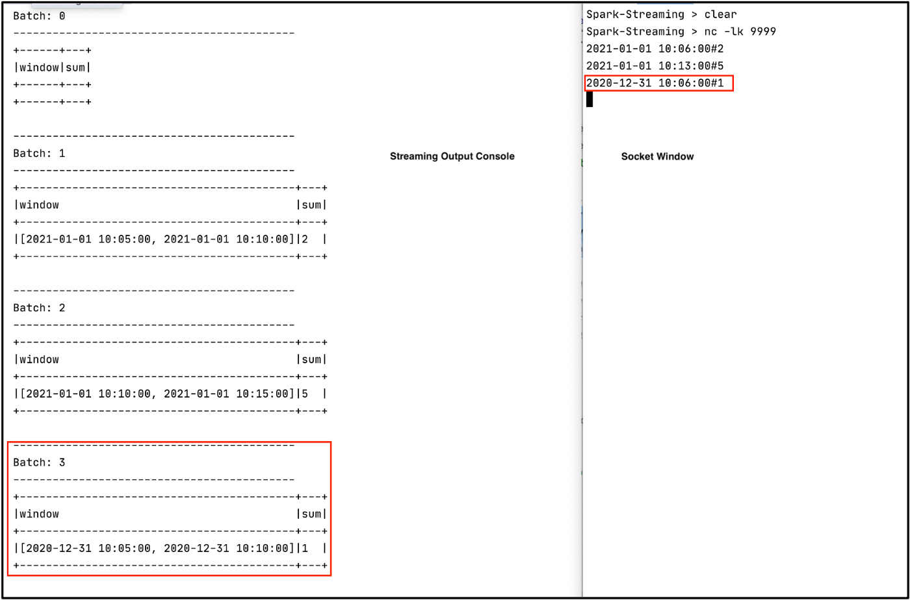

In this post, we discuss watermarking in Apache Spark™️ Streaming.

# Setup
We read data from a socket (`127.0.0.1:9999`) and pass along data which is `#` separated. Then we create a DataFrame with 2 columns `event_timestamp` and `val`. 
```
// Import libraries
import org.apache.spark.sql.SparkSession
import org.apache.spark.sql.functions._

// Create Spark Session
val spark = SparkSession
  .builder()
  .master("local")
  .appName("WaterMark")
  .getOrCreate()

// Set Spark logging level to ERROR.
spark.sparkContext.setLogLevel("ERROR")

// Define host and port number to Listen.
val host = "127.0.0.1"
val port = "9999"

// Create Streaming DataFrame by reading data from socket.
val initDF = spark
  .readStream
  .format("socket")
  .option("host", host)
  .option("port", port)
  .load()

// Create DataFrame with event_timestamp and val column
val eventDF = initDF.select(split(col("value"), "#").as("data"))
  .withColumn("event_timestamp",    element_at(col("data"),1).cast("timestamp"))
  .withColumn("val", element_at(col("data"),2).cast("int"))
  .drop("data")
```

Now let’s open port `9999` and send some data, do the window aggregation and display the results on console. We kept the size of the tumbling window as `5 minutes`. 
```
val resultDF = eventDF
  .groupBy(window(col("event_timestamp"), "5 minute"))
  .agg(sum("val").as("sum"))
```



The first 2 records are from `1st Jan 2021` while the 3rd record is from the `31st Dec 2020`. Let’s consider the third record late data. (Please be aware that the definition of late data varies from application to application). With window operations, a streaming application will process all data and put late data into an older window. At the same time, it maintains state for the old data which might not be required anymore. We can use `watermarking` to handle late data so that the system discards records automatically.

Now let’s add `withWatermark()` to our application and see how it works. We set `watermark` to `delayThreshold = 10 minutes` as well as `windowDuration = 5 minutes` using `groupBy()`. Watermark is set to `max event time seen so far — delayThreshold`. Let’s understand with an example.
```
val resultDF = eventDF
  .withWatermark("event_timestamp", "10 minutes")
  .groupBy(window(col("event_timestamp"), "5 minute"))
  .agg(sum("val").as("sum"))
```

Open the port `9999` , start our streaming application and send the same data again to the socket. Sample data can be found here. Let's discuss each record in detail.

1. **First record**: `2021–01–01 10:06:00#2` It will be processed since this is the first record.
Output:
```
-------------------------------------------
Batch: 1
-------------------------------------------
+------------------------------------------+---+
|window                                    |sum|
+------------------------------------------+---+
|[2021-01-01 10:05:00, 2021-01-01 10:10:00]|2  |
+------------------------------------------+---+
```

> Note: Batch:0 was empty.

Since size of the window is 5 minutes we have a window value of [`2021–01–01 10:05:00, 2021–01–01 10:10:00`]

2. **Second record**: `2021–01–01 10:13:00#5`
We have only processed one record so far, which means `max event time = 2021–01–01 10:06:00`. Hence, the watermark (`max event time — delayThreshold`) is `2021–01–01 09:56:00`. For a window of size `5 minutes`, the watermark window will be `[09:55:00, 10:00:00]`. So any data earlier than the start of the watermark window (2021–01–01 09:55:00) will be discarded. However, the event time (`2021–01–01 10:13:00`) for the second record is greater than the start time of the watermark window, so it will be processed.

>Note: in the watermark window, I only included time because date will always be 2021–01–01 in our dataset.

```
-------------------------------------------
Batch: 2
-------------------------------------------
+------------------------------------------+---+
|window                                    |sum|
+------------------------------------------+---+
|[2021-01-01 10:10:00, 2021-01-01 10:15:00]|5  |
+------------------------------------------+---+
```

3. **Third Record**: `2020–12–31 10:06:00#1`
Our system’s current state is
- max event time: [2021–01–01 10:13:00]
- watermark: [2021–01–01 10:03:00]
- watermark window: [2021–01–01 10:00:00, 2021–01–01 10:05:00]

For this event, the timestamp is less than the start of the watermark window, hence it will be treated as late data and discarded. We will get an empty batch.

```
-------------------------------------------
Batch: 4
-------------------------------------------
+------+---+
|window|sum|
+------+---+
+------+---+
```

4. **Fourth Record**: `2021–01–01 10:08:00#8`
- max event time: [2021–01–01 10:13:00]
- watermark: [2021–01–01 10:03:00]
- watermark window: [10:00:00, 10:05:00]

This event’s time is greater than the start of the watermark window, hence it will be processed.
```
-------------------------------------------
Batch: 5
-------------------------------------------
+------------------------------------------+---+
|window                                    |sum|
+------------------------------------------+---+
|[2021-01-01 10:05:00, 2021-01-01 10:10:00]|10 |
+------------------------------------------+---+
```

5. **Fifth Record**: `2021–01–01 10:00:01#7`
- max event time: [2021–01–01 10:13:00]
- watermark: [2021–01–01 10:03:00]
- watermark window: [10:00:00, 10:05:00]

This event’s time is slightly greater than the start of the watermark window, hence it will be processed.

6. **Sixth Record**: `2021–01–01 9:59:00#3`
- max event time: [2021–01–01 10:13:00]
- watermark: [2021–01–01 10:03:00]
- watermark window: [10:00:00, 10:05:00]

This event’s time is less than the start of the watermark window, hence it will not be processed.

Here is the consolidated list of all ingested events with max event seen so far, watermark, watermark window, and if they were processed or not.

Ingest above data into our streaming application and verify the processed status. 

You can find the complete code on GitHub: https://github.com/NeerajBhadani/spark-streaming/blob/master/src/main/scala/watermarkOperation.scala