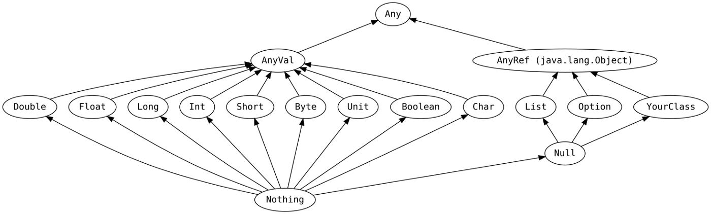
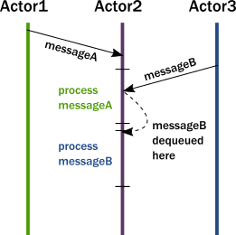

Scala is a programming language released in 2004 by Martin Odersky. It provides support for functional programming and is designed to be concise and compiled to Java bytecode so that a Scala application can be executed on a Java Virtual Machine (JVM).

Let’s check at the core features of the language.

# Hello World
First, let’s see how to implement a hello world in Scala:
```scala
package io.teivah.helloworld

object HelloWorld {
  def main(args: Array[String]) {
    println("Hello, World!")
  }
}
```

We defined a `HelloWorld` object containing a `main` method. This method takes an array of `String` as an input.

In the main, we called the method `println` which takes an object as an input to print something in the console.

Meanwhile, `HelloWorld` is also part of the `io.teivah.helloworld` package.

# Values
We can name the result of an expression using the `val` keyword. In the following example, both expressions are a valid way to define a value:
```scala
val v1: String = "foo"
val v2 = "bar"
```

The type is optional. In the example, `v1` and `v2` are both typed as a String.

The Scala compiler can infer the type of a value without having to explicitly declare it. 
This is known as type inference.

A value in Scala is **immutable**. This means, the following code is not going to compile:
```scala
val i = 0
i = 1 // Compilation error
```

Last but not least, a value can be evaluated **lazily** using the `lazy` keyword:
```scala
lazy val context = initContext()
```

In this case, `context` will not be evaluated during its declaration but during its first invocation.

# Variables
A variable is a **mutable** value. It is declared with the `var` keyword.
```scala
var counter = 0
counter = counter + 5
```

Just like with values, the type is optional. Yet, a variable cannot be evaluated lazily.

Furthermore, Scala is a **statically typed language**. The following code, for example, is invalid as we try to map an `Int` into a variable already defined as a `String`:
```scala
var color = "red"
color = 5 // Invalid
```

# Blocks
In Scala, we can combine expressions by surrounding them with `{}`. Let’s consider the `println()` function which takes an object as an input. The two following expressions are similar:
```scala
println(7) // Prints 7

println {
  val i = 5
  i + 2
} // Prints 7
```

Note that for the second `println` the last expression (`i + 2`) is the result of the overall block.

When we call a function with a single argument just like `println`, we can also omit the parenthesis:
```scala
println 7
```

# Basic Types
Scala is considered a pure object-oriented language because **every value is an object**. Hence, there is no primitive in Scala (like Java `int` for example).

There are 8 basic types in Scala:
- `Byte`
- `Short`
- `Int`
- `Long`
- `Float`
- `Double`
- `Char`
- `Boolean`



Every basic Scala type inherits from `AnyVal`.
On the other side, `AnyRef` is an alias for `java.lang.Object`. Lastly, both `AnyVal` and `AnyRef` inherits from `Any`.

# String Interpolation
Scala provides an elegant way to embed variable/value references directly in processed string literals. As a concrete example:
```scala
val name = "Bob"
println(s"Hello $name!") // Hello Bob!
```

This is made possible by the `s` interpolator before the quotation mark. 
Otherwise, it would print `Hello $name!`.

There are few interpolators provided by Scala but it is a customizable mechanism. We can create for example our own interpolator to handle JSON conversions like this: `println(json"{name: $name}")`.

# Array and List
An array is also handled in Scala as an object:
```scala
val a = new Array[Int](2)
a(0) = 5
a(1) = 2
```
Two things to highlight here.

Firstly, the way to set elements. Instead of using `a[0]` like in many languages, we use the syntax `a(0)`. This is a syntactic sugar to let us call an object just as **if it was a function**. Under the hood, the compiler is calling a default method called `apply()` taking a single input (an `Int` in our case) to make it possible.

Secondly, despite being declared as a `val` in this example, the `Array` object is mutable so we can change the value of indexes 0 and 1. 
`val` just enforces to not mutate the reference, not the corresponding object.

An array can also be initialized this way:
```scala
val a = Array(5, 2)
```
This expression is similar than above. Moreover, because it is initialized with 5 and 2, the compiler infers a as an `Array[Int]`.

To manage multi-dimensional arrays:
```scala
val m = Array.ofDim[Int](3, 3)
m(0)(0) = 5
```

This code creates a two-dimensional array and initializes the very first element to 5.

There are many different data structures composing the Scala standard library.
One of them is the **immutable** `List`:
```
val list = List(5, 2)
list(0) = 5 // Compilation error
```
Compared to `Array`, modifying an index after having initialized a `List` will lead to a compilation error.

# Map
A map can be initialized like this:
```scala
val colors = Map("red" -> "#FF0000", "azure" -> "#F0FFFF", "peru" -> "#CD853F")
```

Note the `->` operator to associate a color key to its corresponding hexadecimal value.

`Map` is an **immutable** data structure. Adding an element means creating another `Map`:
```scala
val colors1 = Map("red" -> "#FF0000", "azure" -> "#F0FFFF", "peru" -> "#CD853F")
val colors2 = colors1 + ("blue" -> "#0033FF")
```

Meanwhile, the elements cannot be modified. In the case we need a mutable structure, we can use `scala.collection.mutable.Map`:
```scala
val states = scala.collection.mutable.Map("AL" -> "Alabama", "AK" -> "tobedefined")
states("AK") = "Alaska"
```

In this example, we mutated the `AK` key.

# Methods/Functions: Basics
We have to make the distinction between methods and functions. 
A method is a function that is a **member** of a class, trait or object (we are going those notions).

Let’s see a basic method example:
```scala
def add(x: Int, y: Int): Int = {
  x + y
}
```

Here we defined an `add` method with the `def` keyword. It took two `Int` as an input and returned an `Int`. Both inputs are **immutable** (in the sense that they are managed just like if they were declared as `val`).

The `return` keyword is optional. The method will automatically return the last expression. Moreover, it’s worth mentioning that in Scala (compared to Java), `return` exits the **current method**, not the current block.

One last thing to add, the **return type is optional**. The Scala compiler is also able to infer it. Yet, for the sake of code maintainability, it might be a good option to set it explicitly.

Furthermore, a method without output can be written is both ways:
```scala
def printSomething(s: String) = {
  println(s)
}

def printSomething(s: String): Unit = {
  println(s)
}
```

We can also return multiple outputs like this:
```scala
def increment(x: Int, y: Int): (Int, Int) = {
  (x + 1, y + 1)
}
```

This prevents us from having to wrap a set of outputs in a specific object.

Another syntactic sugar to mention. Let’s consider a `bar` method without arguments. We can call this method in both ways:
```scala
def foo(): Unit = {
  bar()
  bar
}
```

The best practice is to keep the parenthesis only if bar introduces a side-effect. Otherwise, we call `bar` like in the second expression.

Also, Scala allows us to indicate that a method argument can be **repeated**. Just like in Java, this repeatable argument must be the last parameter:
```scala
def variablesArguments(args: Int*): Int = {
  var n = 0
  for (arg <- args) {
    n += arg
  }
  n
}
```

Here, we iterate over each `args` element and we return an aggregated sum.

Last but not least, we can also define default parameters value:
```scala
def default(x: Int = 1, y: Int): Int = {
  x * y
}
```

Invoking `default` without providing a value for `x` can be done in two ways.

First, using the `_` operator:
```scala
default(_, 3)
```

Or, using named arguments like this:
```scala
default(y = 3)
```

# Methods/Functions: Advanced
## Nested Methods
In Scala, we can **nest method definitions**. Let’s consider the following example:
```scala
def mergesort1(array: Array[Int]): Unit = {
  val helper = new Array[Int](array.length)
  mergesort2(array, helper, 0, array.length - 1)
}

private def mergesort2(array: Array[Int], helper: Array[Int], low: Int, high: Int): Unit = {
  if (low < high) {
    val middle = (low + high) / 2
    mergesort2(array, helper, low, middle)
    mergesort2(array, helper, middle + 1, high)
    merge(array, helper, low, middle, high)
  }
}
```

In this case, `mergesort2` method is used solely by `mergesort1`. To restrict its access, we may decide to set it `private` (we’ll see later on the different visibility levels).

Yet, in Scala we can also decide to nest the second method into the first one like that:
```scala
def mergesort1(array: Array[Int]): Unit = {
  val helper = new Array[Int](array.length)
  mergesort2(array, helper, 0, array.length - 1)

  def mergesort2(array: Array[Int], helper: Array[Int], low: Int, high: Int): Unit = {
    if (low < high) {
      val middle = (low + high) / 2
      mergesort2(array, helper, low, middle)
      mergesort2(array, helper, middle + 1, high)
      merge(array, helper, low, middle, high)
    }
  }
}
```

`mergesort2` becomes available only in the scope of `mergesort1`.

## Higher-Order Functions
Higher-order functions **take as parameters a function or return a function as a result**. As an example of a method taking a function as a parameter:
```scala
def foo(i: Int, f: Int => Int): Int = {
  f(i)
}
```

`f` is a function taking an `Int` as an input and returning an `Int`. In our example, `foo` delegates the execution to `f` by passing `i` to it.

## Function Literals
Scala is considered as a functional language in the sense that **every function is a value**. It means we can express a function in a function literal syntax like that:
```scala
val increment: Int => Int = (x: Int) => x + 1

println(increment(5)) // Prints 6
```

`increment` is a function with an `Int => Int` type (which could have been inferred by the Scala compiler). For each integer `x` it returns `x + 1`.

If we take again the previous example, we could pass `increment` to `foo`:
```scala
def foo(i: Int, f: Int => Int): Int = {
  f(i)
}

def bar() = {
  val increment: Int => Int = (x: Int) => x + 1

  val n = foo(5, increment)
}
```

We can also manage so-called anonymous functions:
```scala
val n = foo(5, (x: Int) => x + 1)
```

The second parameter is a function without any name.

## Closure
A closure in a function literal which **depends** on the value of one or more variable/value declared outside this function.

A simple example:
```scala
val Pi = 3.14

val foo = (n: Int) => {
  n * Pi
}
```

Here, `foo` depends on `Pi` which is declared outside of `foo`.

## Partial Functions
Let’s consider the following method to compute the speed from a distance and a time:
```scala
def speed(distance: Float, time: Float): Float = {
  distance / time
}
```

Scala allows us to **partially apply** speed by calling it only with a subset of the mandatory inputs:
```scala
val partialSpeed: Float => Float = speed(5, _)
```

Note that in this example, none of the parameters of `speed` have a default value. So in order to call it, we need to fill all the parameters.

In this example, `partialSpeed` is a function of type `Float => Float`.

Then, in the same way as we were calling `increment`, we can call `partialSpeed` like this:
```scala
println(partialSpeed(2.5f)) // Prints 2.0
```

## Currying
A method can define multiple parameter lists:
```scala
def multiply(n1: Int)(n2: Int): Int = {
  n1 * n2
}
```

This method is doing exactly the same job than:
```scala
def multiply2(n1: Int, n2: Int): Int = {
  n1 * n2
}
```

Yet, the way to call `multiply` is different:
```scala
val n = multiply(2)(3)
```

Like requested by the method signature, we call it with two lists of parameters.
Then, what if we call `multiply` with only one list of parameters?
```scala
val partial: Int => Int = multiply(2)
val a = partial(5)            //val a: Int = 10
```

In this case, we partially applied `multiply` which gives us in return an `Int => Int` function.

What are the **benefits**? Let’s consider a function to send a message given a particular context:
```scala
def send(context: Context, message: Array[Byte]): Unit = {
  // Send message
}
```

As you can see, there’s an effort made to make this function pure. 
Instead of depending on an external context, we make it available as a parameter of the `send` function.

Yet, it might be somewhat tedious to have to pass this context during every single call of `send`. 
Or maybe a function does not need to know about the context.

One solution may be to partially apply `send` with a predefined context and to manage an `Array[Byte] => Unit` function.

Another solution is to curry `send` and make the `context` parameter `implicit` like this:
```scala
def send(message: Array[Byte])(implicit context: Context): Unit = {
  // Send message
}
```

How can we call `send` in this case? We can define an `implicit` context before to call `send`:
```scala
implicit val context = new Context(...)
send(bytes)
```

The `implicit` keyword means that for every function managing an implicit `Context` parameter, we don’t even need to pass it. It will **automatically** be mapped by the Scala compiler.

In our case, `send` manages the `Context` object as a potential implicit (we can also decide to pass it explicitly). So, we can simply call `send` with the first argument list.

# Classes
A class in Scala is a similar concept than in Java:
```scala
class Point(var x: Int, var y: Int) {
  def move(dx: Int, dy: Int): Unit = {
    x += dx
    y += dy

    println(s"$x $y")
  }
}
```

`Point` exposed a default `(Int, Int)` constructor because of the syntax line 1. Meanwhile, `x` and `y` are two members of the class.

A class can also contain a collection of methods just like `move` in the previous example.

We can instantiate `Point` with the `new` keyword:
```scala
val point = new Point(5, 2)
```

A class can be abstract meaning it cannot be instantiated.

# Case Classes
Case classes are a particular kind of classes. If you are familiar with DDD (Domain Driven Design), a case class is a **value object**.

By default, a case class is **immutable**:
```scala
case class Point(x: Int, y: Int)
```

The value of `x` and `y` cannot be changed.

A case class must be instantiated without `new`:
```scala
val point = Point(5, 2)
```

Case classes (compared to regular classes) are compared by value (and not by reference):
```scala
if (point1 == point2) {
  // ...
} else {
  // ...
}
```

# Objects
An object in Scala is a singleton:
```scala
object EngineFactory {
  def create(context: Context): Engine = {
    // ...
  }
}
```

Objects are defined with the object keyword (👏).

# Traits
Traits are in a way similar to Java interfaces. They are used to share interfaces between classes but also fields. As an example:
```scala
trait Car {
  val color: String
  def drive(): Point
}
```

A trait method can also have a default implementation.
Traits cannot be instantiated but they can be extended by classes and objects.

# Visibility
In Scala, every member of a class/object/trait is public by default. There are two other access modifiers:
- `protected`: members are only accessible from sub-classes
- `private`: members are only accessible from the current class/object

Furthermore, we can also have a more granular way to restrict access by specifying a package in which the restriction is applied.

Let’s consider a class `Foo` in a `bar` package. If we want to make a method private only outside of `bar` we can do it this way:
```scala
class Foo {
  private[bar] def foo() = {}
}
```

# Generics
Generics is also a feature provided by Scala:
```scala
class Stack[A] {
  def push(x: A): Unit = { 
    // ...
  }
}
```

To instantiate a generic class:
```scala
val stack = new Stack[Int]
stack.push(1)
```

# If-else
If-else syntax is similar in Scala than in several other languages:
```scala
if (condition1) {

} else if (condition2) {

} else {

}
```

Yet, in Scala an if-else statement is also an **expression**. It means we can, for example, define methods like this:
```scala
def max(x: Int, y: Int) = if (x > y) x else y
```

# Loops
A basic loop can be implemented like this:
```scala
// Include
for (a <- 0 to 10) {
  println(a)
}

// Exclude
for (a <- 0 until 10) {
  println(a)
}
```

`to` means from 0 to 10 included whereas `until` means from 0 to 10 excluded.

We can also loop over two elements:
```scala
for (a <- 0 until 2; b <- 0 to 2) {
  
}
```

In this example we iterated over all the possible tuple combinations:
```
a=0, b=0
a=0, b=1
a=0, b=2
a=1, b=0
a=1, b=1
a=1, b=2
```

We can also include conditions in the for. Let’s consider the following list of elements:
```scala
val list = List(5, 7, 3, 0, 10, 6, 1)
```

If we need to iterate over each element of `list` and consider only the even integers, we can do it this way:
```scala
for (elem <- list if elem % 2 == 0) {
  
}
```

Moreover, Scala provides so-called **for comprehensions** to create sequence of elements with the form `for() yield element`.
As an example:
```scala
val sub = for (elem <- list if elem % 2 == 0) yield elem
```

In this example, we created a collection of even integers by iterating over each element and *yielding* it in case it is even. As a result, `sub` will be inferred as a sequence of integers (a `Seq` object, the parent of `List`).

In the same way than with if-else statement, for is also an expression. So we can also define methods like this:
```scala
def even(list: List[Integer]) = for (elem <- list if elem % 2 == 0) yield elem
```

# Pattern Matching
Pattern matching is a mechanism to check a value against a given pattern.
It is an enhanced version of the Java `switch` statement.

Let’s consider a simple function to translate an integer into a string:
```scala
def matchA(i: Int): String = {
  i match {
    case 1 => return "one"
    case 2 => return "two"
    case _ => return "something else"
  }
}
```

Scala adds a bit of syntactic sugar to implement an equivalent this way:
```scala
def matchB(i: Int): String = i match {
  case 1 => "one"
  case 2 => "two"
  case _ => "something else"
}
```

First, we removed the `return` statements.
Then, `matchB` function becomes a pattern matcher as we removed the block statement after the function definition.

Anything else apart from some sugar? Pattern matching is a great addition to case classes. Let’s consider an example taken from Scala documentation.

We want to return a `String` depending on a notification type.
We define an abstract class `Notification` and two case classes `Email` and `SMS`:
```scala
abstract class Notification
case class Email(sender: String, title: String, body: String) extends Notification
case class SMS(caller: String, message: String) extends Notification
```

The most elegant way to do it in Scala is to use **pattern matching** on the notification:
```scala
def showNotification(notification: Notification): String = {
  notification match {
    case Email(email, title, _) =>
      s"You got an email from $email with title: $title"
    case SMS(number, message) =>
      s"You got an SMS from $number! Message: $message"
  }
}
```

This mechanism allows us to cast the given `notification` and to automatically parse the parameters we are interested in. For example, in the case of an email, maybe we are not interested in displaying the `body` so we simply omit it with `_` keyword.

# Exceptions
Let’s consider the concrete use case where we need to print the number of bytes from a given file. To perform the I/O operation, we are going to use `java.io.FileReader` which may throw exceptions.

The most common way to do it if you are a Java developer would be something like this using a try/catch statement:
```scala
try {
  val n = new FileReader("input.txt").read()
  println(s"Success: $n")
} catch {
  case e: Exception =>
    e.printStackTrace
}
```

The second way to implement it is somewhat similar to Java `Optional`. As a reminder, `Optional` is a container brought in Java 8 for optional values.

In Scala, `Try` is a **container for success or failures**. It is an abstract class, extended by two case classes `Success` and `Failure`.
```scala
val tried: Try[Int] = Try(new FileReader("notes.md")).map(f => f.read())
    
tried match {
  case Success(n) => println(s"Success: $n")
  case Failure(e) => e.printStackTrace
}
```

We first wrap the creation of a new `FileReader` in a `Try` call. We use a map to convert an eventual `FileReader` to an `Int` by calling the `read` method. As a result, we get a `Try[Int]`.

Then, we can use pattern matching to determine the type of `tried`.

# Implicit Conversions
Let’s analyze the following example:
```scala
case class Foo(x: Int)
case class Bar(y: Int, z: Int)

object Consumer {
  def consume(foo: Foo): Unit = {
    println(foo.x)
  }
}

object Test {
  def test() = {
    val bar = new Bar(5, 2)
    Consumer.consume(bar)
  }
}
```

We defined two case classes `Foo` and `Bar`.
Meanwhile, an object `Consumer` exposes a `consume` method taking a `Foo` in parameter.
In `Test`, we call `Consumer.consume()` but **not with a** `Foo` as required by the signature of the method but with a `Bar`. How is this possible?

In Scala, we can define implicit conversions between two classes. In the last example, we simply need to describe how to convert a `Bar` to a `Foo`:
```scala
implicit def barToFoo(bar: Bar): Foo = new Foo(bar.y + bar.z)
```

If this method `barToFoo` is imported, the Scala compiler will make sure that we can call `consumer` with **either** a `Foo` or a `Bar`.

# Concurrency
To handle concurrency, Scala was initially based on the [actor model](https://en.wikipedia.org/wiki/Actor_model). Scala was providing the `scala.actors` library. Yet, since Scala 2.10 this library became deprecated in favor of [Akka actors](https://doc.akka.io/docs/akka/current/index-actors.html?language=scala).

Akka is a set of libraries for implementing concurrent and distributed applications. Nonetheless, we can also use Akka only at the scale of a single process.

The main idea is to manage actors as a **primitive for concurrent computation**. An actor can send messages to other actors, receive and react to messages and spawn new actors.



Just like other concurrent computation models like CSP (Communicating Sequential Processes), the key is to communicate **through messages** instead of sharing memory between different threads.