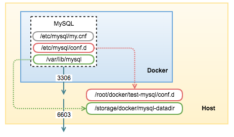

# Docker
Think about a container as a “lightweight virtual machine”. Unlike virtual machines though, containers do not require an entire operating system, all required ibraries and the actual application binaries. The same Linux kernel and libraries can be shared between multiple containers running on the host. Docker makes it easy to package Linux software in self-contained images, where all software dependencies are bundled and deployed in a repeatable manner. An image will have exactly the same software installed, whether we run it on a laptop or on a server. The key benefit of Docker is that it allows users to package an application with all of its dependencies into a standardized unit (container). Running many containers allows each one to focus on a specific task; multiple containers then work in concert to implement a distributed system.

The easiest tutorial you can have a look at it is this: https://www.youtube.com/watch?v=gAkwW2tuIqE

# TLDR
- First, create a Dockerfile. This will give instructions of how to create an image
- Next, build the docker image using DOckerfile (`docker build`)
- Once, image is built, push it to a registry such as AWS ECR or Docker Registry. This image will then be pulled to build other images.
- Once, image is pulled, we run the container using `docker run`

Here onwards, we describe each and every step.

## Build Docker image:
The command for creating an image from a Dockerfile is `docker build`.
```
docker build .
```

When you have many images, it becomes difficult to know which image is what. Docker provides a way to tag your images with friendly names of your choosing. This is known as tagging.
```
docker build -t yourusername/repository-name .
```

Let’s proceed to tag the Docker image of an example app:
```
docker build -t yourusername/example-node-app
```

If you run the command above, you should have your image tagged already.  Running `docker images` will show your image with the name you’ve chosen.
```
docker images
REPOSITORY TAG IMAGE ID CREATED SIZE
vpiusr/example-node-app latest be083a8e3159 7 minutes ago 83.2MB
```

Now, whenever you make changes to your files, you will need to rebuild you images. See technical difference between Image and container for this part (added later).
Now, when we make changes to the Dockerfile, these don't get applied to the already existing container. As a result, whenever we run `docker start` command or `docker-compose up` command, it will pick the existing image and spin container from that image, or will start an existing conatiner. Only thing that will persist or change in each instance is the volume which is where the data is stored. So everytime you make changes to you Dockerfile, you need to rebuild the container. Rebuilding and restarting isn't enough. Containers don't work like a service: Stopping the service, do your changes, restart it and they would apply. Because containers are permanent, you have to remove them using first. After a container is removed, you can't simply start it by docker start. This has to be done using `docker run`, which itself uses the latest image for creating a new container-instance.


For Dockerfile:
- Remove container:
  ```
  docker rm <ContainerName> 
  ```
- Run the container. You can't use `docker start` as you first need to build the image:
  ```
  docker run
  ```

Here is all the steps:
```
#!/bin/bash
imageName=xx:my-image
containerName=my-container

docker build -t $imageName -f Dockerfile  .

echo Delete old container...
docker rm -f $containerName

echo Run new container...
docker run -d -p 5000:5000 --name $containerName $imageName
```

For Docker-compose:
- Start Docker compose with `--build` tag:
  ```
  docker-compose up --build
  ```

You can also build your containers from custom location and custom Dockerfile. These are added and described later.

## Create volume
Docker containers are stateless. So, if you use a Containerized MySQL, then you will lose all your saved Data once you restart the container. One way to avoid the issue is to create a docker volume and attach it to your MySQL container. Here are the commands to create a MySQL container including attached volume in your local machine:
The following command will create the volume in your local machine which you can connect with MySQL container later:
```
λ docker volume create mysql-volume
mysql-volume
```

Listing volumes:
```
docker volume ls
```

Inspecting created volume:
```
docker volume inspect <volume_name>
```

Removing volume:
```
docker volume rm <volume_name>
```

Prune volume: This will remove all unused volume:
```
docker volume prune
```

You can even copy files from one volume to another using:
docker run -it --name=another-example --mount source=demo-volume,destination=/data ubuntu

## Pull image from repository
You first pull latest docker image:
```
docker pull mysql/mysql-server:latest
```

You can check all locally saved images as follows:
```
docker images
```

## Start/Deploy Docker container
The following command will pull the MySQL server version 8.0.20 from the Docker registry and then instantiate a Docker container with the name `mk-mysql` from the image `mysql/mysql-server:8.0.20`. It will also attach the previously created volume `mysql-volume` with the Database and will expose the port `3306` so that you can reach the MySQL database outside the container:
```
λ docker run --name=mk-mysql -p3306:3306 -v mysql-volume:/var/lib/mysql -e MYSQL_ROOT_PASSWORD=my-secret-pw -d mysql/mysql-server:8.0.20
Unable to find image ‘mysql/mysql-server:8.0.20’ locally
8.0.20: Pulling from mysql/mysql-server
```

**Port mapping explanation:**
Here, Ports are mapped as `LOCAL:CONTAINER`. So here, 3306:3306 will be local 3306 mapped to 3306. FOr clearer explanation, let's take the following example:
- In the DOCKERFILE, `EXPOSE` port 8080 for your web application
- When you build your image, it will define the port 8080 to be the port the docker container will use.
- Now, if you run `localhost:8080`, you won't see your application
- So when you run your docker, map it as follows: `-p 5000:8080`. This means local system's port 5000 is mapped to Docker's 8080
- Try running `localhost:5000`. You will now see your app.

If you don't pull image from repository, `docker run` will get/pull it. `docker run` checks for local image before pulling from remote.

Some other ways to write the same thing:
```
$ docker run --detach --name=<container-name> --env="MYSQL_ROOT_PASSWORD=mypassword" mysql

$ docker run \
--detach \
--name=<container-name> \
--env="MYSQL_ROOT_PASSWORD=mypassword" \
--publish 6603:3306 \
--volume=/root/docker/<container-name>/conf.d:/etc/mysql/conf.d \
mysql
```

### Docker `run` vs `start`
- `run`: create a new container of an image, and execute the container (or as stated in official documentation: run a commend in new container). You can create N clones of the same image. The command is: `docker run IMAGE_ID` and not `docker run CONTAINER_ID`
- `start`: Launch a container previously stopped (or as stated in official documentation: Start one or more stopped containers). For example, if you had stopped a database with the command `docker stop CONTAINER_ID`, you can relaunch the same container with the command `docker start CONTAINER_ID`, and the data and settings will be the same.

You can also use `docker restart <container-name>`, instead of stopping and starting containers.

**Explanation with example:**

Consider you have a game (iso) image in your computer. When you run (mount your image as a virtual drive), a virtual drive is created with all the game contents in the virtual drive and the game installation file is automatically launched. [Running your docker image - creating a container and then starting it.] But when you stop (similar to docker stop) it, the virtual drive still exists but stopping all the processes. [As the container exists till it is not deleted.] And when you do start (similar to docker start), from the virtual drive the games files start its execution. [starting the existing container].

## Checking Docker container
You can check whether the container is running by listing the running containers:
```
λ docker ps
CONTAINER ID IMAGE COMMAND CREATED STATUS PORTS NAMES
d54e7992094b mysql/mysql-server:8.0.20 "/entrypoint.sh mysq…" Less than a second ago Up 4 seconds (health: starting) 0.0.0.0:3306->3306/tcp, 33060/tcp mk-mysql
```

    `docker ps -a` will show even the stopped containers


You can also check the log file of the running MySQL container with the following command:
```
λ docker logs <container-name>
```

You can check low-level information on your Docker container by running the following command:
```
docker inspect <container-name>
```


## Access Docker container
Now, you can connect to the container’s interactive bash shell with the following command:
```
λ docker exec -it mk-mysql bash
bash-4.2#
```
Once you are inside your container, you can connect to your MySQL server and create a new Database as follows:
```
bash-4.2# mysql -u root -p
Enter password:
...
mysql> CREATE DATABASE MYSQLTEST;
Query OK, 1 row affected (0.00 sec)
```

    Please note that you have to give the same password we have defined to run the container (`my-secret-pw`).

One more way we can do this is as follows:
```
docker exec -it <container-name> mysql -uroot -p
```

By default, MySQL restricts connection other than the local machine (here Docker container) for security reasons. So, to connect from the local machine, you have to change the connection restriction:
```
mysql> update mysql.user set host = ‘%’ where user=’root’;
Query OK, 1 row affected (0.02 sec)
```

Although for security reasons, it would be better to create a new non-admin user and grant access to that user only. 
Creating non-admin user can be done as follows:
```
docker run --name=<container_name> -p3306:3306 -e MYSQL_USER=varun -e MYSQL_PASSWORD=vprod -e MYSQL_ROOT_PASSWORD=test mysql
```

When you try to access this, use the following to login:
```
docker exec -it <container_name> mysql -uvarun -p
```
Password here will be `vprod`

### Connecting to the Container
we retrieve the IP address of that container in order to access it. Run the inspect command:
```
docker inspect <container-name>
```
We can see lots of low-level information of that container. Lookup the “IPAddress” line:
```
"IPAddress": "172.17.0.20",
```

From the physical host, we can now access the MySQL server. Voila! We now have a MySQL instance running in a container. However, this port is only accessible within the Docker network. If you have another Docker container for your application, you can connect with them directly via IP address 172.17.0.20 on port 3306.

Docker allocates a dynamic IP address on every running container. Whenever a container is restarted, you will get a new IP address. You can get the IP address range from the Docker network interface in the Linux box. Run the following command to see Docker’s network range:
```
$ ip a | grep docker | grep inet
    inet 172.17.42.1/16 scope global docker0
```
Our container’s IP address is 172.17.0.20 which is in the range of `172.17.42.1/16`. Let’s restart the container, and you should get a new IP address being assigned by Docker:
```
$ docker stop test-mysql
$ docker start test-mysql
$ docker inspect test-mysql | grep IPAddress
        "IPAddress": "172.17.0.21",
```
Our IP address just changed to 172.17.0.21. If you had an application that connects to this container via the old IP address, the application would not get connected anymore. Docker introduces another way to link your container with another container, to ensure whatever IP address assigned to it will get updated in the linked container. Let’s say we deploy a Wordpress application (which has no MySQL installed on that image), and want to link with our existing MySQL container, test-mysql. Here is what you should do:
```
$ docker run --detach --name test-wordpress --link test-mysql:mysql wordpress
```
In a couple of minutes, the container `test-wordpress` will be up and running and linked to our test-mysql container:
```
$ docker ps
CONTAINER ID        IMAGE               COMMAND                CREATED             STATUS              PORTS               NAMES
0cb9f4152022        wordpress:latest    "/entrypoint.sh apac   15 seconds ago      Up 15 seconds       80/tcp              test-wordpress
0a7aa1cf196e        mysql:latest        "docker-entrypoint.s   16 minutes ago      Up 16 minutes       3306/tcp            test-mysql
```

To verify if it’s linked correctly, enter the `test-wordpress` container and look at the content of `/etc/hosts`:
```
$ docker exec -it test-wordpress bash
root@0cb9f4152022:/var/www/html# cat /etc/hosts
172.17.0.22    0cb9f4152022
127.0.0.1    localhost
::1    localhost ip6-localhost ip6-loopback
fe00::0    ip6-localnet
ff00::0    ip6-mcastprefix
ff02::1    ip6-allnodes
ff02::2    ip6-allrouters
172.17.0.21    mysql 0a7aa1cf196e test-mysql
```

The application can now see an entry with IP address and hostname related to the linked MySQL container. If you restart the MySQL container and get another IP address, the entry will be updated by Docker accordingly.

You can also expose the MySQL container to the outside world by mapping the container’s MySQL port to the host machine port using the publish flag. Let’s re-initiate our container and run it again with an exposed port:
```
$ docker rm -f test-mysql
$ docker run --detach --name=test-mysql --env="MYSQL_ROOT_PASSWORD=mypassword" --publish 6603:3306 mysql
```

Verify if the container is correctly mapped:
```
CONTAINER ID        IMAGE               COMMAND                CREATED             STATUS              PORTS                    NAMES
8d97b70658a9        mysql:latest        "docker-entrypoint.s   3 seconds ago       Up 3 seconds        0.0.0.0:6603->3306/tcp   test-mysql
0cb9f4152022        wordpress:latest    "/entrypoint.sh apac   15 minutes ago      Up 15 minutes       80/tcp                   test-wordpress
```

At this point, we can now access the MySQL container directly from the machine’s port 6603.

### Data storage
There are several ways to store data used by MySQL that run in Docker containers. Docker can manage the storage of your database’s data by writing the database files to disk on the host system, using its own internal volume management (Read about creating volumes above). If you run the `inspect` command, look at the `Volumes` directive and you should notice by default MySQL data directory (`/var/lib/mysql`) is mounted into Docker’s internal volume:
```
$ docker inspect test-mysql | grep Volumes
    ...
    "Volumes": {
        "/etc/mysql/conf.d": "/root/docker/test-mysql/conf.d",
        "/var/lib/mysql": "/var/lib/docker/vfs/dir/4d437e2fe5ab2f71ffeea2590d72a417a9ca88607c130b46f5ad819d0a5b68cd"
    }
```

This is the easiest way and fairly transparent to the user. The downside is that the files may be hard to locate for tools and applications that run directly on the host system, i.e. outside containers.

The other way is to create a data directory on the host system (outside the container) and mount this to a directory visible from inside the container. This places the database files in a known location on the host system, and makes it easy for tools and applications on the host system to access the files. The downside is that the user needs to make sure that the directory exists, and that e.g. directory permissions and other security mechanisms on the host system are correctly set up.

Create a data directory on a suitable volume on your host system, e.g. `/storage/docker/mysql-datadir`:
```
$ mkdir -p /storage/docker/mysql-datadir
```

Start your mysql container like this:
```
$ docker run \
--detach \
--name=test-mysql \
--env="MYSQL_ROOT_PASSWORD=mypassword" \
--publish 6603:3306 \
--volume=/root/docker/test-mysql/conf.d:/etc/mysql/conf.d \
--volume=/storage/docker/mysql-datadir:/var/lib/mysql \
mysql
```
The `--volume=/storage/docker/mysql-datadir:/var/lib/mysql` part of the command mounts the `/storage/docker/mysql-datadir directory` from the underlying host system as `/var/lib/mysql` inside the container, where MySQL by default will write its data files (`conf.d` is explained under configuration management in MySQL containers in subequent section), as illustrated in the following diagram:



When inspecting the container, you should see the following lines:
```
$ docker inspect test-mysql
    ...
    "Volumes": {
        "/etc/mysql/conf.d": "/root/docker/test-mysql/conf.d",
        "/var/lib/mysql": "/storage/docker/mysql-datadir"
    }
```

Which is now clearer for you to see the directory and files on the machine host created by this container:
```
$ ls -al /storage/docker/mysql-datadir/
total 188452
drwxr-xr-x 5  999  999     4096 Jun  3 10:13 .
drwxr-xr-x 3 root root     4096 Jun  3 10:06 ..
-rw-r----- 1  999  999       56 Jun  3 10:13 auto.cnf
-rw-r----- 1  999  999     1329 Jun  3 10:13 ib_buffer_pool
-rw-r----- 1  999  999 79691776 Jun  3 10:13 ibdata1
-rw-r----- 1  999  999 50331648 Jun  3 10:13 ib_logfile0
-rw-r----- 1  999  999 50331648 Jun  3 10:13 ib_logfile1
-rw-r----- 1  999  999 12582912 Jun  3 10:13 ibtmp1
drwxr-x--- 2  999  999     4096 Jun  3 10:13 mysql
drwxr-x--- 2  999  999     4096 Jun  3 10:13 performance_schema
drwxr-x--- 2  999  999    12288 Jun  3 10:13 sys
```

Note that restarting or removing the container does not remove the MySQL data directory. When you restart a MySQL container by using `stop` and `start` command, it would be similar to restarting the MySQL service in a standard installation:
```
$ docker stop test-mysql
$ docker start test-mysql
```

If you remove the MySQL container, the data in the mounted volumes will still be intact and you can run a new instance, mounting the same volume as data directory:
```
$ docker rm -f test-mysql
$ docker run -d --name=new-mysql -p 6604:3306 -v /storage/docker/mysql-datadir:/var/lib/mysql mysql
```

    If a MySQL container runs on top of an existing MySQL datadir, the $MYSQL_ROOT_PASSWORD variable should be omitted from the “run” command line; it will in any case be ignored, and the pre-existing database will not be changed in any way.

However, only one running (active) container is allowed to access the MySQL data directory at a time. Running another container mounting the same datadir volume will cause MySQL startup error on the later container:
```
$ docker run -d --name=another-new-mysql -p 6605:3306 -v /storage/docker/mysql-datadir:/var/lib/mysql mysql
$ docker logs another-new-mysql
2016-06-10T07:16:59.538635Z 0 [Note] InnoDB: Completed initialization of buffer pool
2016-06-10T07:16:59.540373Z 0 [Note] InnoDB: If the mysqld execution user is authorized, page cleaner thread priority can be changed. See the man page of setpriority().
2016-06-10T07:16:59.551646Z 0 [ERROR] InnoDB: Unable to lock ./ibdata1 error: 11
2016-06-10T07:16:59.551656Z 0 [Note] InnoDB: Check that you do not already have another mysqld process using the same InnoDB data or log files.
2016-06-10T07:16:59.551659Z 0 [Note] InnoDB: Retrying to lock the first data file
2016-06-10T07:17:00.552294Z 0 [ERROR] InnoDB: Unable to lock ./ibdata1 error: 11
2016-06-10T07:17:00.552364Z 0 [Note] InnoDB: Check that you do not already have another mysqld process using the same InnoDB data or log files.
```
This is expected since a MySQL process must exclusively own the MySQL data directory to avoid any potential conflicts. Having more than one `mysqld` process connecting to the same data directory is just not feasible. That’s why MySQL horizontal scaling can only be achieved via replication.


## Stop Docker container
Stop and remove docker container as follows:
```
docker stop <container-name>
docker rm <container-name>
```

### Docker `stop` vs `rm`
`docker stop` preserves the container in the `docker ps -a` list (which gives the opportunity to commit it if you want to save its state in a new image). It sends SIGTERM first, then, after a grace period, SIGKILL.

`docker rm` will remove the container from `docker ps -a` list, losing its "state" (the layered filesystems written on top of the image filesystem). It cannot remove a running container (unless called with -f, in which case it sends SIGKILL directly).

In term of lifecycle, you are supposed to stop the container first, then remove it.


# Dockerfile
Here we use a `Dockerfile` example.

Take the following example:
```
# syntax=docker/dockerfile:1
FROM python:3.7-alpine
WORKDIR /code
ENV FLASK_APP=app.py
ENV FLASK_RUN_HOST=0.0.0.0
RUN apk add --no-cache gcc musl-dev linux-headers
COPY requirements.txt requirements.txt
RUN pip install -r requirements.txt
EXPOSE 5000
COPY . .
CMD ["flask", "run"]
```

This tells Docker to:
- Build an image starting with the Python 3.7 image.
- Set the working directory to `/code`.
- Set environment variables used by the flask command.
- Install `gcc` and other dependencies
- Copy `requirements.txt` and install the Python dependencies.
- Add metadata to the image to describe that the container is listening on port `5000`
- Copy the current directory `.` in the project to the workdir `.` in the image.
- Set the default command for the container to flask run. (By default, we run flask command as `flask run`)

Once `Dockerfile` has been created, we keep it in the same directory as our project. This ensures that the `COPY . .` copy all files to the working directory inside the container. Also, we would be already inside our project directory when we would be running so we can build the image easily.

Run the following command:
```
docker build -t <container-image-name> .

# If file name is not Dockerfile:
docker build -f dockerfiles/test1.Dockerfile  -t test1_app .
# or
docker build -f dockerfiles/Dockerfile-test1  -t test1_app .
```

This command used the Dockerfile to build a new container image. You might have noticed that a lot of “layers” were downloaded. This is because we instructed the builder that we wanted to start from the `python:3.7-alpine` image. But, since we didn’t have that on our machine, that image needed to be downloaded.

After the image was downloaded, we copied in our application and used `RUN` to install our application’s dependencies. The `CMD` directive specifies the default command to run when starting a container from this image.

Finally, the `-t` flag tags our image. Think of this simply as a human-readable name for the final image. Since we named the image `<container-image-name>`, we can refer to that image when we run a container.

The `.` at the end of the docker build command tells that Docker should look for the Dockerfile in the current directory.

Start your container using the `docker run` command and specify the name of the image we just created:
```
docker run -dp 3000:3000 <container-image-name>
```
Remember the `-d` and `-p` flags? We’re running the new container in “detached” mode (in the background) and creating a mapping between the host’s port 3000 to the container’s port 3000. Without the port mapping, we wouldn’t be able to access the application.

After a few seconds, open your web browser to http://localhost:3000. You should see our app.


# Technical details
## Difference between Image and container
To use a programming metaphor, if an image is a class, then a container is an instance of a class—a runtime object. Containers are hopefully why you’re using Docker; they’re lightweight and portable encapsulations of an environment in which to run applications.

Here is a video which explains the fundamental difference between Image and Container:
https://www.youtube.com/watch?v=CSb-sHNM2NY

The gist is as follows:
- **Dockerfile** is a blueprint on how to create an image
- **Image** is a template for the creation of container. Think of Image as a cookie cutter. On its own, a cookie cutter is not a cookie. It's just a template on how to create cookies of same dimension.
- **Container** is a running instance of the application. Think of container as the cookie.

You can see all the docker images as follows:
```
docker images
```

Remove the docker image:
```
docker image rm <image_name>
```

You can see running containers as follows:
```
docker ps -a

# Exited containers:
docker ps --filter status=exited
```

Some important point:
- `IMAGE ID` is the first 12 characters of the true identifier for an image. You can create many tags of a given image, but their IDs will all be the same:
  ```
  REPOSITORY                TAG                 IMAGE ID            CREATED             VIRTUAL SIZE
  ubuntu                    13.10               5e019ab7bf6d        2 months ago        180 MB
  ubuntu                    14.04               99ec81b80c55        2 months ago        266 MB
  ubuntu                    latest              99ec81b80c55        2 months ago        266 MB
  ubuntu                    trusty              99ec81b80c55        2 months ago        266 MB
  <none>                    <none>              4ab0d9120985        3 months ago        486.5 MB
  ```
  
  The value in the REPOSITORY column comes from the `-t` flag of the `docker build` command, or from docker tag-ing an existing image. You’re free to tag images using a nomenclature that makes sense to you, but know that docker will use the tag as the registry location in a docker push or docker pull.


## Difference between Dockerfile ENV and Docker compose environments
Environment variable defined in Dockerfile will not only be used in `docker build`, it will also persist into the container. This means if you did not set `-e` when `docker run`, it will still have environment variable same as defined in Dockerfile, while environment variable defined in `docker-compose.yaml` is just used for `docker run`.

Maybe next example could make you understand more clear:

Dockerfile:
```
FROM alpine
ENV http_proxy http://123
```

docker-compose.yaml:
```
app:
  environment:
    - http_proxy=http://123
```

If you define environment variable in Dockerfile, all containers used this image will also have the `http_proxy` as http://123. But the real life situation maybe when you build the image, you need this proxy. But, the container maybe run by other people and maybe they don't need this proxy or just have another `http_proxy`, so they have to remove the `http_proxy` in entrypoint or just change to another value in `docker-compose.yaml`.

If you define environment variable in `docker-compose.yaml`, then user could just choose his own `http_proxy` when do `docker-compose up`, `http_proxy` will not be set if user did not configure it `docker-compose.yaml`.

## ENV vs ARG
ENV is for future running containers. ARG for building your Docker image.

## Environment variable
asd

# Specific Docker container examples
## MySQL
### Configuration Management
The container comes with a standard MySQL configuration options inside `/etc/mysql/my.cnf`. Let’s say our application that connects to this MySQL server requires more `max_connections` (default is 151) during startup, so we need to update the MySQL configuration file. The best way to do this in a container is to create alternative configuration files in a directory on the host machine and then mount that directory location as `/etc/mysql/conf.d` inside the mysql container.

On the host machine, create a directory and a custom MySQL configuration file:
```
$ mkdir -p /root/container/test-mysql/conf.d
$ vim /root/container/test-mysql/conf.d/my-custom.cnf
```

And add the following lines:
```
[mysqld]
max_connections=200
```

Then, we have to re-initiate the MySQL container (remove and run) by mapping the volume path as shown in the following command (the long command is trimmed to make it more readable):
```
$ docker run \
--detach \
--name=test-mysql \
--env="MYSQL_ROOT_PASSWORD=mypassword" \
--publish 6603:3306 \
--volume=/root/docker/test-mysql/conf.d:/etc/mysql/conf.d \
mysql
```

This will start a new container `test-mysql` where the MySQL instance uses the combined startup settings from the default `/etc/mysql/my.cnf` and `/etc/mysql/conf.d/my-custom.cnf`, with settings from the latter taking precedence.

Verify the new setting is loaded from the machine host:
```
$ mysql -uroot -pmypassword -h127.0.0.1 -P6603 -e 'show global variables like "max_connections"';
+-----------------+-------+
| Variable_name   | Value |
+-----------------+-------+
| max_connections | 200   |
+-----------------+-------+
```

Many configuration options can also be passed as flags to mysqld. This will give you the flexibility to customize the container without needing a custom .cnf file. For example, if you want to change the max connections similar to the above and collation for all tables to use UTF-8 (utf8mb4), just run the following:
```
$ docker run \
--detach \
--name=test-mysql \
--env="MYSQL_ROOT_PASSWORD=mypassword" \
--publish 6603:3306 \
mysql \
--max-connections=200 \
--character-set-server=utf8mb4 \
--collation-server=utf8mb4_unicode_ci
```

### Accessing MySQL Instance
So you have configured Docker Compose and run it. Now there are few ways to access MySQL:
- Access MySQL from Host
- Access MySQL from inside container
- Access MySQL from MySQL Workbench or any other GUI Tools.

**Access MySQL from Host** 

This one is a little bit tricky because you have to install mysql-shell in your host then you can access it from host terminal. You can follow instructions here.

After installation, try to access mysql container from host with following command.
```
$ mysql -h localhost -P 3306 --protocol=tcp -u root -p
```

**Access MySQL from inside container**

This is most easiest way to access MySQL and check whether your MySQL instance is okay or not without installing other applications. You can use container’s bash. This method is described above (`docker exec`).

**Access MySQL from MySQL Workbench or any other GUI Tools**

If you prefer to use GUI Tools such as MySQL Workbench, you can connect it with following configurations:
- Connection Method : Standard (TCP/IP)
- Hostname : 127.0.0.1 (or your remote server address)
- Port : 3306
- Username: root (or using other user)
- Password: root (your root password)

## Web application with Flask and Redis
We keep the following 2 files in our project directory:
- `Dockerfile`
- `docker-compose.yml`

We save a `Dockerfile` first as follows:
```
# syntax=docker/dockerfile:1
FROM python:3.7-alpine
WORKDIR /code
ENV FLASK_APP=app.py
ENV FLASK_RUN_HOST=0.0.0.0
RUN apk add --no-cache gcc musl-dev linux-headers
COPY requirements.txt requirements.txt
RUN pip install -r requirements.txt
EXPOSE 5000
COPY . .
CMD ["flask", "run"]
```

Next, we create a Docker Compose file:
```
version: "3.9"
services:
  web:
    build: .
    ports:
      - "8000:5000"
    volumes:
      - .:/code
    environment:
      FLASK_ENV: development
  redis:
    image: "redis:alpine"
```

The `web` service uses an image that’s built from the `Dockerfile` in the current directory. It then binds the container and the host machine to the exposed port, 8000. This example service uses the default port for the Flask web server, 5000. So, in our browser, we would see the service at http://localhost:8000/

The `volumes` key mounts the project directory (current directory) on the host to `/code` inside the container, allowing you to modify the code on the fly, without having to rebuild the image. The `environment` key sets the `FLASK_ENV` environment variable, which tells flask run to run in `development` mode and reload the code on change. This mode should only be used in development. `FLASK_ENV` is a Flask specific variable to run the application debug mode (meaning more verbose error messages and application need not restart to check new changes, as in dynamic changes will be visible). 

https://docs.docker.com/compose/gettingstarted/

## Kafka
Sample Docker compose
```
version: '2'
services:
  zookeeper:
    image: wurstmeister/zookeeper:3.4.6
    ports:
     - "2181:2181"
  kafka:
    image: wurstmeister/kafka
    ports:
     - "9092:9092"
    expose:
     - "9093"
    environment:
      KAFKA_ADVERTISED_LISTENERS: INSIDE://kafka:9093,OUTSIDE://localhost:9092
      KAFKA_LISTENER_SECURITY_PROTOCOL_MAP: INSIDE:PLAINTEXT,OUTSIDE:PLAINTEXT
      KAFKA_LISTENERS: INSIDE://0.0.0.0:9093,OUTSIDE://0.0.0.0:9092
      KAFKA_INTER_BROKER_LISTENER_NAME: INSIDE
      KAFKA_ZOOKEEPER_CONNECT: zookeeper:2181
      KAFKA_CREATE_TOPICS: "topic_test:1:1"
    volumes:
     - /var/run/docker.sock:/var/run/docker.sock
```